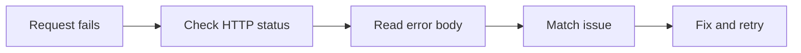

## Error Codes

Use this page to diagnose common Vercel API errors, deployment failures, and rate-limit responses. Each entry follows a Problem → Cause → Fix pattern so you can move from the symptom to the likely resolution quickly.

### Status code quick reference

| Status | Meaning | Typical Vercel symptom |
| ------ | ------- | ---------------------- |
| `400` | Bad request | Invalid JSON body, malformed query string, or missing required fields |
| `401` | Unauthorized | Missing or invalid authentication |
| `403` | Forbidden | Token lacks access to the project, team, or action |
| `404` | Not found | Project, deployment, or resource does not exist |
| `409` | Conflict | A deployment or project update conflicts with existing state |
| `413` | Payload too large | Request body or upload exceeds the allowed size |
| `429` | Too many requests | You are sending requests faster than the rate limit allows |
| `500` | Internal error | Vercel could not complete the request |
| `502` | Bad gateway | Deployment or runtime returned an invalid upstream response |
| `503` | Service unavailable | Temporary platform or regional availability issue |

<Callout kind="info">
For every failure, capture the full response body, request ID, and timestamp before you retry. Those details make support checks and log correlation much faster.
</Callout>

### Troubleshooting flow



### Common response fields

<ResponseField name="error" field-type="string" required="true">
Short machine-readable error type, such as `rate_limit_exceeded` or `invalid_request`.
</ResponseField>

<ResponseField name="message" field-type="string" required="true">
Human-readable explanation of the failure.
</ResponseField>

<ResponseField name="code" field-type="string" required="false">
Stable error code that helps you classify the failure.
</ResponseField>

<ResponseField name="requestId" field-type="string" required="false">
Unique identifier for tracing the request in logs and support cases.
</ResponseField>

## Deployment and project errors

<ExpandableGroup>
  <Expandable title="400 Bad request: invalid deployment payload" default-open="true">

    **Problem**

    Your deployment request fails with a message like `400 Bad Request` or `Invalid JSON payload`.

    **Cause**

    The request body is missing required fields, contains malformed JSON, or sends values in the wrong format. A common symptom is a CLI or API call that includes a trailing comma, an empty string where a project name is required, or an invalid environment field.

    **Fix**

    Validate the JSON before sending it, then retry the request with the required fields present. If you use deployment creation, make sure the payload includes the correct project reference, source, and environment values.

    ```bash
    curl -X POST https://api.example.com/v1/deployments \
      -H "Authorization: Bearer YOUR_API_KEY" \
      -H "Content-Type: application/json" \
      -d '{"name":"my-project","target":"production"}'
    ```

    If the request still fails, compare the body you sent with the endpoint schema and check for unsupported fields.

  </Expandable>

  <Expandable title="401 Unauthorized: missing or invalid credentials" default-open="false">

    **Problem**

    The API returns `401 Unauthorized` and the response body says `Invalid token` or `Authorization header missing`.

    **Cause**

    You did not send a bearer token, the token is expired, or the token string is malformed. This also happens when you accidentally pass a placeholder value instead of a real credential in your local shell.

    **Fix**

    Send the `Authorization` header with a valid bearer token and confirm that your environment variable resolves to a non-empty value.

    ```bash
    export VERCEL_TOKEN=YOUR_API_KEY
    curl https://api.example.com/v1/projects \
      -H "Authorization: Bearer $VERCEL_TOKEN"
    ```

    If you rotate tokens, update all automation that still uses the old token before retrying.

  </Expandable>

  <Expandable title="403 Forbidden: insufficient access to the project or team" default-open="false">

    **Problem**

    The request returns `403 Forbidden`, often with a message like `You do not have permission to access this project`.

    **Cause**

    The token is valid, but it does not have access to the target team, project, or operation. This can happen when the token belongs to a different account, or when the action requires a higher permission level than the token provides.

    **Fix**

    Verify that the token belongs to the correct Vercel account and has access to the same team as the project. If you are automating project changes, use a token issued for the owner or team that manages that project.

    Check the project identifier and team context before retrying the request.

  </Expandable>

  <Expandable title="404 Not found: project, deployment, or resource missing" default-open="false">

    **Problem**

    The API returns `404 Not Found` when you query a project, deployment, or alias.

    **Cause**

    The resource identifier is wrong, the project was deleted, or the request is scoped to the wrong team. A deployment lookup can also fail if you copied an outdated deployment ID from logs or a preview URL.

    **Fix**

    Confirm the identifier you are sending matches the resource you expect. Re-run the list endpoint for the same team, then copy the current ID from the response.

    If the project exists in another team, switch to the correct team context and repeat the request.

  </Expandable>

  <Expandable title="409 Conflict: deployment or project update already in progress" default-open="false">

    **Problem**

    The request returns `409 Conflict` and the body mentions a deployment already exists or a resource is locked.

    **Cause**

    You submitted a second update while the first deployment, alias change, or project mutation is still being processed. Conflicts also occur when two automation runs try to manage the same project at the same time.

    **Fix**

    Wait for the first operation to finish, then retry with backoff. If your automation can run in parallel, add a lock so only one job updates the same resource at a time.

    ```bash
    while true; do
      status=$(curl -s https://api.example.com/v1/deployments/DEPLOYMENT_ID/status)
      echo "$status"
      break
    done
    ```

    If the same conflict repeats, check whether a background process is continuously recreating the resource.

  </Expandable>

  <Expandable title="413 Payload too large: request body or upload exceeds limits" default-open="false">

    **Problem**

    The API returns `413 Payload Too Large` during deployment or file upload.

    **Cause**

    The request body, archive, or asset exceeds the platform limit for the endpoint you are using. This often appears when a bundle includes large generated assets, unneeded source maps, or cached output that should not be uploaded.

    **Fix**

    Reduce the upload size by excluding build artifacts you do not need, splitting large assets, or sending a smaller request body. If the endpoint accepts streamed content, use that path instead of one large payload.

    Rebuild locally and verify the archive size before retrying.

  </Expandable>

  <Expandable title="500 Internal error: platform could not finish the request" default-open="false">

    **Problem**

    The response is `500 Internal Server Error` or `Something went wrong on our end`.

    **Cause**

    The platform encountered an unexpected failure while processing the request. This is usually transient, but it can also appear when an upstream service or internal dependency errors before the request completes.

    **Fix**

    Retry the request after a short delay. If the same request fails repeatedly, save the request ID and the exact timestamp, then open a support case with the full response body.

    Do not keep retrying in a tight loop, because that only adds more load without improving the result.

  </Expandable>
</ExpandableGroup>

## Rate limiting

<Steps>
  <Step title="Recognize the limit response" icon="alert-triangle">
    A rate-limited response usually returns `429 Too Many Requests` and may include a message such as `Rate limit exceeded`.

    The response can appear after repeated project updates, deployment polling, or aggressive list requests.
  </Step>

  <Step title="Read the retry guidance" icon="info">
    Check the response headers and body for a retry delay or a reset time.

    If the response includes `Retry-After`, wait for that interval before sending another request.
  </Step>

  <Step title="Reduce request frequency" icon="settings">
    Batch non-urgent calls, cache list results, and avoid polling the same endpoint every second.

    If your workflow needs regular checks, increase the interval between calls and stop once you see the expected state.
  </Step>

  <Step title="Retry with backoff" icon="zap">
    Use exponential backoff with jitter so concurrent jobs do not retry at the same instant.

    ```bash
    sleep 2
    curl https://api.example.com/v1/deployments \
      -H "Authorization: Bearer YOUR_API_KEY"
    ```
  </Step>
</Steps>

<Callout kind="tip">
For automation, treat `429` as a signal to slow down, not as a permanent failure. Your code should retry only after the retry window ends.
</Callout>

## Error handling examples

<Tabs>
  <Tab title="cURL" icon="terminal">

    ```bash
    curl -i https://api.example.com/v1/projects/PROJECT_ID \
      -H "Authorization: Bearer YOUR_API_KEY"
    ```

  </Tab>
  <Tab title="JavaScript" icon="code">

    ```javascript
    const response = await fetch("https://api.example.com/v1/projects/PROJECT_ID", {
      headers: {
        Authorization: "Bearer YOUR_API_KEY"
      }
    });

    if (!response.ok) {
      const error = await response.json();
      console.error(error.message);
    }
    ```

  </Tab>
  <Tab title="Python" icon="terminal">

    ```python
    import requests

    response = requests.get(
        "https://api.example.com/v1/projects/PROJECT_ID",
        headers={"Authorization": "Bearer YOUR_API_KEY"},
    )

    if not response.ok:
        print(response.json()["message"])
    ```

  </Tab>
</Tabs>

## Field-level response guidance

Use the returned status code, message, and request identifier together. The status code tells you the class of failure, the message explains what went wrong, and the request ID helps you trace the exact event in logs.

<Columns cols={3}>
  <Card title="Authentication" icon="lock" href="#deployment-and-project-errors">
    Start here when you see `401` or `403`.
  </Card>
  <Card title="Request validation" icon="check-circle" href="#deployment-and-project-errors">
    Start here when you see `400` or `413`.
  </Card>
  <Card title="Platform availability" icon="cloud" href="#deployment-and-project-errors">
    Start here when you see `500`, `502`, or `503`.
  </Card>
</Columns>

## What to capture before retrying

Before you retry a failing request, capture the exact response body, the HTTP status, the endpoint path, and the `requestId` if one is present. Keep the original command or client call intact so you can compare what changed between attempts.

If you are troubleshooting a deployment issue, also record the deployment ID, project ID, and the time you sent the request. That context usually narrows the root cause quickly.

<Expandable title="Checklist for support-ready errors" default-open="false">

- HTTP status code
- Full response body
- Request ID
- Timestamp in UTC
- Endpoint path
- Project ID or deployment ID
- Exact command or code used to send the request

</Expandable>