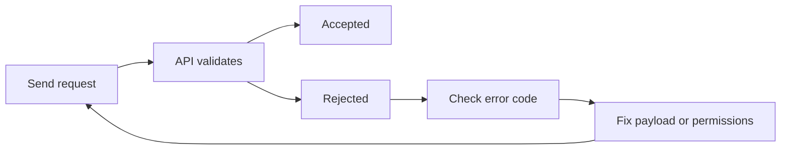

## Overview

ShopifyMax returns structured error responses when a creative brief, asset upload, or publishing request fails. You use these errors to fix request payloads, correct permissions, or retry after temporary limits clear.

The examples on this page use `api.example.com` and the `example.com` domain pattern shown in the website content. They are documentation-only placeholders.

<Callout kind="info">
Use the HTTP status code first, then inspect the error `code` and `message` fields. The message tells you what failed; the code tells you how to fix it.
</Callout>

### Error response shape

```json
{
  "error": {
    "code": "validation_failed",
    "message": "cover_image is required",
    "request_id": "req_01HZX4A1D2",
    "details": [
      {
        "field": "cover_image",
        "issue": "missing"
      }
    ]
  }
}
```

## Common error categories

<Columns cols={2}>
  <Card title="Validation errors" icon="x-circle" href="#validation-errors">
  
  Request data is missing, malformed, or uses an unsupported value.
  
  </Card>

  <Card title="Permission failures" icon="lock" href="#permission-failures">
  
  Your account can reach the API, but it cannot perform the requested action.
  
  </Card>

  <Card title="Rate limiting" icon="zap" href="#rate-limiting">
  
  You have sent too many requests in a short period.
  
  </Card>

  <Card title="Asset processing issues" icon="settings" href="#asset-processing-issues">
  
  ShopifyMax accepted the upload, but processing failed after intake.
  
  </Card>
</Columns>

## Troubleshooting

### Validation errors

<Expandable title="Problem: `400 validation_failed` when submitting a creative brief" default-open="true">

**Problem**

You send a brief to `POST /v1/briefs`, and ShopifyMax returns:

```json
{
  "error": {
    "code": "validation_failed",
    "message": "headline is required",
    "request_id": "req_01HZX4B8K9"
  }
}
```

**Cause**

One or more required fields are missing, empty, or incorrectly typed. Common fields that fail validation are `headline`, `objective`, `brand_voice`, `deliverables`, and `due_date`.

**Fix**

Include every required field and send values in the expected format. For dates, use ISO 8601. For arrays, send JSON arrays, not comma-separated strings.

```bash
curl -X POST "https://api.example.com/v1/briefs" \
  -H "Content-Type: application/json" \
  -d '{
    "headline": "Summer destination launch",
    "objective": "Increase brand awareness for the new property opening",
    "brand_voice": "editorial, refined, immersive",
    "deliverables": ["landing page", "email", "social assets"],
    "due_date": "2026-07-15"
  }'
```

If the API still rejects the request, inspect `details[].field` to see the exact field that failed.

</Expandable>

<Expandable title="Problem: `422 invalid_enum_value` for brand tone or asset type">

**Problem**

You submit a brief or upload payload with a value ShopifyMax does not recognize:

```json
{
  "error": {
    "code": "invalid_enum_value",
    "message": "tone must be one of: editorial, playful, luxury, minimal",
    "request_id": "req_01HZX4C2T4"
  }
}
```

**Cause**

The request uses a string outside the allowed set. This often happens with `tone`, `asset_type`, `format`, or `priority`.

**Fix**

Replace the value with one of the documented options. Do not send custom labels unless the field explicitly allows free text.

```json
{
  "tone": "luxury",
  "asset_type": "image",
  "format": "png",
  "priority": "high"
}
```

If you are unsure which values are valid, check the field-level validation in the request schema before resubmitting.

</Expandable>

<Expandable title="Problem: `400 invalid_json` after a retry">

**Problem**

The API returns:

```json
{
  "error": {
    "code": "invalid_json",
    "message": "Request body could not be parsed",
    "request_id": "req_01HZX4D7Q1"
  }
}
```

**Cause**

The body is not valid JSON. This usually happens when you include trailing commas, unescaped quotes, or raw line breaks inside strings.

**Fix**

Rebuild the payload and verify it with a JSON linter before sending it. If you use `curl`, keep the body inside a single quoted string and escape internal quotes correctly.

```bash
curl -X POST "https://api.example.com/v1/briefs" \
  -H "Content-Type: application/json" \
  -d '{"headline":"Luxury launch","objective":"Drive inquiries"}'
```

</Expandable>

### Permission failures

<Expandable title="Problem: `403 forbidden` when creating or editing briefs">

**Problem**

Your request is authenticated, but ShopifyMax returns:

```json
{
  "error": {
    "code": "forbidden",
    "message": "Your role does not allow brief creation",
    "request_id": "req_01HZX4E1M8"
  }
}
```

**Cause**

The current user, team member, or integration does not have the correct role or project access. This often affects create, update, and publish actions.

**Fix**

Confirm that the caller has the required permission for the workspace and the specific destination or campaign. If the request targets a restricted project, reassign access before retrying.

```bash
curl -X GET "https://api.example.com/v1/me" \
  -H "Authorization: Bearer YOUR_API_KEY"
```

Use the returned account context to verify that you are calling the API from the correct workspace.

</Expandable>

<Expandable title="Problem: `401 unauthorized` with `invalid_api_key`">

**Problem**

ShopifyMax rejects the request before it reaches business logic:

```json
{
  "error": {
    "code": "invalid_api_key",
    "message": "Authorization header is missing or invalid",
    "request_id": "req_01HZX4F0P3"
  }
}
```

**Cause**

The `Authorization` header is missing, expired, revoked, or formatted incorrectly. This also happens if you copy a placeholder value into a real request.

**Fix**

Send a valid bearer token and make sure the header format is exact.

```bash
curl "https://api.example.com/v1/briefs" \
  -H "Authorization: Bearer YOUR_API_KEY" \
  -H "Content-Type: application/json"
```

If you recently rotated credentials, update every environment that submits briefs or uploads assets.

</Expandable>

### Rate limiting

<Expandable title="Problem: `429 rate_limited` during bulk brief submission">

**Problem**

You submit many creative briefs in a short window, and ShopifyMax returns:

```json
{
  "error": {
    "code": "rate_limited",
    "message": "Too many requests",
    "request_id": "req_01HZX4G2N6",
    "retry_after": 30
  }
}
```

**Cause**

You exceeded the allowed request rate for your account, workspace, or endpoint. Bulk imports and repeated retries are the most common triggers.

**Fix**

Pause requests and retry after the `retry_after` interval. Add exponential backoff and stop immediate retry loops.

```bash
sleep 30
curl -X POST "https://api.example.com/v1/briefs" \
  -H "Authorization: Bearer YOUR_API_KEY" \
  -H "Content-Type: application/json" \
  -d '{"headline":"New campaign brief"}'
```

If your workflow submits many assets at once, spread uploads across time instead of sending them in one burst.

</Expandable>

### Asset processing issues

<Expandable title="Problem: `202 processing_failed` after an asset upload">

**Problem**

The upload request succeeds, but the asset later fails processing:

```json
{
  "error": {
    "code": "processing_failed",
    "message": "Asset could not be converted",
    "request_id": "req_01HZX4H9R7"
  }
}
```

**Cause**

The asset file is damaged, unsupported, too large, or encoded in a format ShopifyMax cannot convert. This is common with very large images, unusual video codecs, or files with invalid metadata.

**Fix**

Re-export the asset in a supported format and upload again. For images, use a standard web format such as PNG or JPEG. For video, use a widely supported codec and container.

```bash
curl -X POST "https://api.example.com/v1/assets" \
  -H "Authorization: Bearer YOUR_API_KEY" \
  -F "file=@./hero-image.png"
```

If the upload is accepted but processing fails later, keep the `request_id` and check the asset status endpoint before retrying.

</Expandable>

<Expandable title="Problem: `415 unsupported_media_type` for an upload">

**Problem**

The API rejects your file upload with:

```json
{
  "error": {
    "code": "unsupported_media_type",
    "message": "file type application/octet-stream is not supported",
    "request_id": "req_01HZX4J1S2"
  }
}
```

**Cause**

The request declares a file type ShopifyMax does not accept, or the upload tool omits the correct MIME type.

**Fix**

Upload a supported file type and send the correct content metadata. If your tooling guesses the type incorrectly, set it explicitly before retrying.

```bash
curl -X POST "https://api.example.com/v1/assets" \
  -H "Authorization: Bearer YOUR_API_KEY" \
  -F "file=@./brand-film.mp4;type=video/mp4"
```

If the file was generated by another system, re-export it with a standard MIME type.

</Expandable>

### Command reference

Use these checks to isolate the failure before you resubmit the request.

<CodeGroup tabs="bash,JSON">
  ```bash
  curl -i -X POST "https://api.example.com/v1/briefs" \
    -H "Authorization: Bearer YOUR_API_KEY" \
    -H "Content-Type: application/json" \
    -d '{"headline":"Launch","objective":"Increase awareness"}'
  ```

  ```json
  {
    "error": {
      "code": "validation_failed",
      "message": "headline is required",
      "request_id": "req_01HZX4K9V5"
    }
  }
  ```
</CodeGroup>

### Diagnostic checklist

1. Confirm the HTTP status code.
2. Read `error.code` before changing the payload.
3. Check `request_id` and keep it with your support note.
4. Retry only after fixing the root cause.
5. For uploads, verify the file type, size, and conversion status.

## Error code summary

| HTTP status | Error code | Meaning | Typical fix |
| --- | --- | --- | --- |
| 400 | `invalid_json` | The body cannot be parsed. | Rebuild the JSON payload. |
| 400 | `validation_failed` | A required field is missing or invalid. | Add the missing fields or correct the values. |
| 401 | `invalid_api_key` | Authentication failed. | Send a valid bearer token. |
| 403 | `forbidden` | The caller lacks permission. | Use an account with the required role. |
| 415 | `unsupported_media_type` | The file type is not allowed. | Upload a supported format. |
| 422 | `invalid_enum_value` | A field uses an unsupported option. | Replace it with a valid enum value. |
| 429 | `rate_limited` | Too many requests. | Wait and retry after backoff. |
| 202 | `processing_failed` | The asset could not be converted. | Re-export and upload again. |

## Example request flow



## Next steps

If you still cannot resolve the issue, capture the full error payload, the failing request body, and the `request_id` before escalating internally. Keep the failing example small so you can isolate the exact field or asset that triggers the error.