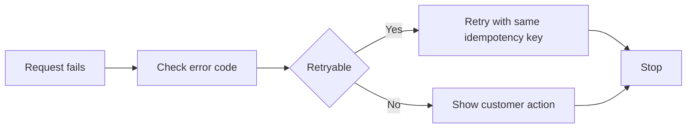

## Error codes at a glance

Stripe errors usually fall into four buckets: payment declines, API errors, dispute and refund failures, and idempotency conflicts. When you troubleshoot, start with the exact error code, then check the request ID, the payment intent status, and whether the failure is retryable.

Use this page as a starter kit. Replace the examples with the codes and logs you see in your own integration.

<Callout kind="info">
Always log the `request_id` returned by Stripe. It lets you correlate your application logs with Stripe support cases and dashboard events.
</Callout>

### Common issue categories

<Columns cols={3}>
  <Card title="Payment declines" icon="x-circle" href="#payment-declines">
    Card network, issuer, or wallet refused the charge.
  </Card>
  <Card title="API errors" icon="alert-triangle" href="#api-errors-and-retries">
    The request was invalid, rate-limited, or temporarily unavailable.
  </Card>
  <Card title="Disputes and refunds" icon="shield" href="#disputes-and-refunds">
    The payment moved into a dispute, reversal, or refund failure state.
  </Card>
</Columns>

## Payment declines

Declines are the most common cause of failed charges. Stripe returns a decline code on the payment attempt, and the customer usually sees a generic failure message such as `Your card was declined.`

### Problem: `Your card was declined`

<Expandable title="Problem → Cause → Fix" default-open="true">

Problem: You create a payment, but the customer sees `Your card was declined` and the payment intent ends in `requires_payment_method`.

Cause: The issuer rejected the payment. Common decline codes include `insufficient_funds`, `incorrect_cvc`, `lost_card`, `stolen_card`, and `do_not_honor`.

Fix:

- Show the customer a payment method update flow.
- Do not retry the same payment method automatically unless the decline is clearly temporary.
- Ask the customer to use another card or complete any authentication step that Stripe requests.

</Expandable>

### Problem: `insufficient_funds`

<Expandable title="Problem → Cause → Fix" default-open="false">

Problem: A charge fails with the decline code `insufficient_funds`.

Cause: The customer does not have enough available balance to complete the authorization.

Fix:

- Tell the customer to use another card or try again after funds are available.
- If you support saved payment methods, prompt the customer to pick a different card.
- Do not retry in a tight loop.

</Expandable>

### Problem: `authentication_required`

<Expandable title="Problem → Cause → Fix" default-open="false">

Problem: The payment fails because the issuer requires customer authentication.

Cause: The card requires an extra authentication step, often because of regional regulations or issuer policy.

Fix:

- Send the customer through the payment confirmation flow again.
- If the attempt is off session, surface the payment as needing action and notify the customer to complete authentication.
- Preserve the original payment intent and confirm it again after authentication completes.

</Expandable>

### Problem: `incorrect_cvc` or `incorrect_number`

<Expandable title="Problem → Cause → Fix" default-open="false">

Problem: The issuer rejects the card with `incorrect_cvc` or `incorrect_number`.

Cause: The customer entered card details incorrectly, or the card data is stale.

Fix:

- Ask the customer to re-enter the card details.
- If the card is saved, ask the customer to update the payment method instead of retrying the old value.
- Verify that your form submits the latest values before confirmation.

</Expandable>

## API errors and retries

API errors usually mean your request failed before Stripe could complete the operation. Some errors are safe to retry, and some are not. Always check the HTTP status, error code, and whether the request already succeeded.

### Problem: `invalid_request_error`

<Expandable title="Problem → Cause → Fix" default-open="true">

Problem: The API returns an error response like:

```text
{
  "error": {
    "type": "invalid_request_error",
    "message": "No such payment_intent: 'pi_123'"
  }
}
```

Cause: The request is malformed, uses the wrong object ID, or references a resource that does not exist in the selected account or mode.

Fix:

- Verify the object ID.
- Confirm you are using the correct environment.
- Check that the parameter name matches Stripe's API field name exactly.
- Re-run the request only after fixing the payload.

</Expandable>

### Problem: `rate_limit_error`

<Expandable title="Problem → Cause → Fix" default-open="false">

Problem: Requests fail with `rate_limit_error` or HTTP `429`.

Cause: Your integration is sending too many requests in a short period.

Fix:

- Back off and retry with exponential delay.
- Reduce duplicate calls from client and server paths.
- Cache the result of reads when possible.
- Avoid retrying unsafe writes without an idempotency key.

</Expandable>

### Problem: `api_connection_error`

<Expandable title="Problem → Cause → Fix" default-open="false">

Problem: Your request times out or fails to connect, often with messages such as `cURL error 28` or `api_connection_error`.

Cause: Network connectivity, DNS, proxy, or TLS problems interrupt the request before Stripe responds.

Fix:

- Retry the request with exponential backoff.
- Check outbound firewall rules and proxy configuration.
- Verify that your server can reach `https://api.example.com` style endpoints in your environment.
- Log the timeout, retry count, and request body size.

</Expandable>

### Problem: `api_error`

<Expandable title="Problem → Cause → Fix" default-open="false">

Problem: Stripe returns a generic server-side failure.

Cause: Stripe experienced a temporary internal error, or the request hit a transient infrastructure issue.

Fix:

- Retry the request safely.
- Use an idempotency key for any write operation you might repeat.
- If the same request keeps failing, capture the `request_id` and contact Stripe support.

</Expandable>

## Disputes and refunds

Disputes and refunds fail for different reasons than authorizations. A payment can succeed, then later move into a disputed or reversed state. Refunds can also fail if the charge is no longer refundable or the balance is unavailable.

### Problem: `charge.dispute.created`

<Expandable title="Problem → Cause → Fix" default-open="false">

Problem: A charge that previously succeeded later enters dispute handling.

Cause: The cardholder challenged the charge with their bank.

Fix:

- Review the dispute evidence as soon as possible.
- Collect receipts, shipping proof, usage records, and customer communication.
- Submit evidence before the deadline shown in the dashboard.
- If you issue a refund, make sure you understand whether the dispute remains open.

</Expandable>

### Problem: refund fails with an insufficient balance message

<Expandable title="Problem → Cause → Fix" default-open="false">

Problem: You request a refund, but Stripe returns a failure indicating that the refund cannot be completed from the available balance.

Cause: Your Stripe balance does not have enough available funds to cover the refund right away.

Fix:

- Wait for available funds to settle.
- Check whether you need to top up balance management in your account.
- Retry the refund after the balance becomes available.

</Expandable>

### Problem: refund already processed

<Expandable title="Problem → Cause → Fix" default-open="false">

Problem: You try to refund a charge and get a response indicating that the refund already exists.

Cause: The refund succeeded on an earlier request, but your application retried the operation without checking the result.

Fix:

- Look up the original refund object before creating a new one.
- Use an idempotency key for the refund request.
- Treat a duplicate refund response as success if the refund already exists.

</Expandable>

## Idempotency key conflicts

Idempotency prevents duplicate writes when a request is retried. Stripe uses the same key and request parameters to deduplicate a write operation.

### Problem: `Keys for idempotent requests can only be reused with the same request parameters`

<Expandable title="Problem → Cause → Fix" default-open="false">

Problem: The API returns an error like:

```text
Keys for idempotent requests can only be reused with the same request parameters.
```

Cause: You reused the same idempotency key for a different payload, or your retry path changed one field after the original request.

Fix:

- Reuse the key only for the exact same logical operation.
- Keep the request body identical across retries.
- Generate a new idempotency key when you intentionally change the amount, customer, currency, or payment method.

</Expandable>

### Problem: duplicate payment after retry

<Expandable title="Problem → Cause → Fix" default-open="false">

Problem: A customer clicks twice, your server retries, and you see two attempts for the same payment.

Cause: The write request was repeated without an idempotency key, or the key changed between retries.

Fix:

- Send an idempotency key on the original create or confirm request.
- Store the key with the order record.
- Reuse the same key for retries of that exact operation only.

</Expandable>

## Retry and handling checklist

Use a consistent retry policy so you do not turn a temporary error into a duplicate payment.

1. Read the Stripe error type and code.
2. Determine whether the error is customer-actionable or retryable.
3. For writes, retry only with the same idempotency key.
4. For payments, confirm the current intent status before sending a second charge attempt.
5. For disputes and refunds, inspect the object in the dashboard before making another change.

### Minimal retry flow



## Troubleshooting examples

The examples below show how to translate a Stripe error into a next step.

<CodeGroup tabs="cURL,JavaScript">
  ```bash
curl https://api.example.com/v1/payment_intents/pi_123/confirm \
  -u sk_test_YOUR_KEY: \
  -H "Idempotency-Key: order_987" \
  -d payment_method=pm_123
  ```

  ```javascript
const response = await fetch("https://api.example.com/v1/payment_intents/pi_123/confirm", {
  method: "POST",
  headers: {
    Authorization: "Bearer sk_test_YOUR_KEY",
    "Idempotency-Key": "order_987",
    "Content-Type": "application/x-www-form-urlencoded"
  },
  body: new URLSearchParams({
    payment_method: "pm_123"
  })
});
  ```
</CodeGroup>

<Callout kind="tip">
If you need to open a support case, include the `request_id`, the full error payload, and the payment intent or charge ID.
</Callout>

## When to escalate

Escalate when you see repeated server errors, unexplained declines across many customers, or a discrepancy between your logs and the Stripe dashboard. Capture the timestamp, request payload, customer context, and any retry attempts before you escalate.

<Expandable title="Useful fields to capture" default-open="false">

- `request_id`
- `payment_intent`
- `charge`
- `refund`
- `dispute`
- `idempotency_key`
- HTTP status code
- Exact error message

</Expandable>