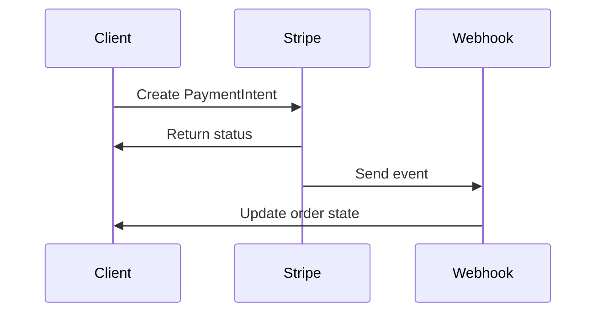

## Quickstart

Use this quickstart to create a customer, attach a test payment method, confirm a `PaymentIntent`, handle Strong Customer Authentication, and receive webhook events. You will work against Stripe test mode, so you can safely run the flow end to end without charging a real card.

<Callout kind="info">

Before you start, you need a Stripe account, a secret key, and access to the Stripe Dashboard. Use test keys only while following this guide.

</Callout>

### What you will build

In less than five minutes, you will complete a minimal payment flow:

1. Create a customer.
2. Create a `PaymentIntent`.
3. Attach a test payment method.
4. Confirm the payment.
5. Listen for `payment_intent.succeeded` and related webhook events.

### Prerequisites

- A Stripe account in test mode
- Your test secret key
- A reachable webhook endpoint for local development
- A way to send `POST` requests to the Stripe API

## Set up your environment

Start by creating a project directory and storing your secret key as an environment variable. Keep the key out of source control and never put it in client-side code.

<Steps>
  <Step title="Create a workspace" icon="folder">
    Create a directory for your quickstart and move into it.

    ```bash
    mkdir stripe-quickstart
    cd stripe-quickstart
    ```
  </Step>

  <Step title="Set your secret key" icon="lock">
    Export your test secret key as an environment variable.

    ```bash
    export STRIPE_SECRET_KEY="sk_test_YOUR_TEST_SECRET_KEY"
    ```
  </Step>

  <Step title="Verify API access" icon="check-circle">
    Confirm that you can make authenticated requests to the Stripe API.

    ```bash
    curl https://api.stripe.com/v1/customers \
      -u "$STRIPE_SECRET_KEY:"
    ```
  </Step>
</Steps>

## Create a customer and payment intent

The example below creates a customer, creates a `PaymentIntent`, and confirms it with a test card. Use `automatic_payment_methods` so Stripe can handle compatible payment methods for you in test mode.

<CodeGroup tabs="cURL,JavaScript,Python">
  ```bash
  curl https://api.stripe.com/v1/customers \
    -u "$STRIPE_SECRET_KEY:" \
    -d name="Quickstart Customer"
  ```

  ```javascript
  const customerResponse = await fetch("https://api.stripe.com/v1/customers", {
    method: "POST",
    headers: {
      Authorization: `Bearer ${process.env.STRIPE_SECRET_KEY}`,
      "Content-Type": "application/x-www-form-urlencoded",
    },
    body: new URLSearchParams({
      name: "Quickstart Customer",
    }),
  });

  const customer = await customerResponse.json();

  const paymentIntentResponse = await fetch("https://api.stripe.com/v1/payment_intents", {
    method: "POST",
    headers: {
      Authorization: `Bearer ${process.env.STRIPE_SECRET_KEY}`,
      "Content-Type": "application/x-www-form-urlencoded",
    },
    body: new URLSearchParams({
      amount: "2000",
      currency: "usd",
      customer: customer.id,
      "automatic_payment_methods[enabled]": "true",
      confirm: "true",
      "payment_method_data[type]": "card",
      "payment_method_data[card][number]": "4242424242424242",
      "payment_method_data[card][exp_month]": "12",
      "payment_method_data[card][exp_year]": "2030",
      "payment_method_data[card][cvc]": "123",
    }),
  });

  const paymentIntent = await paymentIntentResponse.json();
  console.log(paymentIntent);
  ```

  ```python
  import os
  import requests

  customer_response = requests.post(
      "https://api.stripe.com/v1/customers",
      auth=(os.environ["STRIPE_SECRET_KEY"], ""),
      data={"name": "Quickstart Customer"},
  )
  customer = customer_response.json()

  payment_intent_response = requests.post(
      "https://api.stripe.com/v1/payment_intents",
      auth=(os.environ["STRIPE_SECRET_KEY"], ""),
      data={
          "amount": "2000",
          "currency": "usd",
          "customer": customer["id"],
          "automatic_payment_methods[enabled]": "true",
          "confirm": "true",
          "payment_method_data[type]": "card",
          "payment_method_data[card][number]": "4242424242424242",
          "payment_method_data[card][exp_month]": "12",
          "payment_method_data[card][exp_year]": "2030",
          "payment_method_data[card][cvc]": "123",
      },
  )
  payment_intent = payment_intent_response.json()
  print(payment_intent)
  ```
</CodeGroup>

<Callout kind="tip">

If the `PaymentIntent` returns `requires_action`, Stripe is asking you to complete customer authentication. Use the `next_action` details from the response to continue the payment flow.

</Callout>

## Handle Strong Customer Authentication

Some cards require Strong Customer Authentication, also known as SCA or 3D Secure. In that case, your `PaymentIntent` does not succeed immediately. Instead, the response includes a status such as `requires_action` or `requires_confirmation`.

### Test card behavior

Use Stripe test cards to simulate different outcomes:

| Test card | Behavior |
| --- | --- |
| `4242 4242 4242 4242` | Successful payment |
| `4000 0025 0000 3155` | Requires authentication |
| `4000 0000 0000 9995` | Declined payment |

When your integration receives a `requires_action` status, direct the customer through the authentication step shown by Stripe, then confirm the `PaymentIntent` again if needed.

### Inspect the response

After confirmation, look at the `status` field:

- `succeeded` means the payment is complete.
- `requires_action` means the customer must complete authentication.
- `requires_payment_method` means the payment method failed and you should try again.

## Attach a payment method to a customer

When you want to save a card for later reuse, attach the payment method to the customer and set it as the default for invoices or future payments.

<Steps>
  <Step title="Create or reuse a payment method" icon="credit-card">
    Use a test card to create a reusable payment method.

    ```bash
    curl https://api.stripe.com/v1/payment_methods \
      -u "$STRIPE_SECRET_KEY:" \
      -d type="card" \
      -d "card[number]=4242424242424242" \
      -d "card[exp_month]=12" \
      -d "card[exp_year]=2030" \
      -d "card[cvc]=123"
    ```
  </Step>

  <Step title="Attach it to the customer" icon="users">
    Attach the payment method to the customer returned earlier.

    ```bash
    curl https://api.stripe.com/v1/payment_methods/pm_YOUR_PAYMENT_METHOD_ID/attach \
      -u "$STRIPE_SECRET_KEY:" \
      -d customer="cus_YOUR_CUSTOMER_ID"
    ```
  </Step>

  <Step title="Set the default payment method" icon="settings">
    Make the saved card the default for future billing.

    ```bash
    curl https://api.stripe.com/v1/customers/cus_YOUR_CUSTOMER_ID \
      -u "$STRIPE_SECRET_KEY:" \
      -d "invoice_settings[default_payment_method]=pm_YOUR_PAYMENT_METHOD_ID"
    ```
  </Step>
</Steps>

## Receive webhook events

Webhooks let you reliably react to payment state changes. Always verify the event signature before you trust the payload. For this quickstart, listen for at least `payment_intent.succeeded`, `payment_intent.payment_failed`, and `payment_intent.requires_action`.



### Minimal webhook handler

Use a dedicated endpoint to receive Stripe events and branch on the event type.

```bash
curl https://api.stripe.com/v1/webhook_endpoints \
  -u "$STRIPE_SECRET_KEY:" \
  -d url="https://example.com/webhooks/stripe" \
  -d "enabled_events[]=payment_intent.succeeded" \
  -d "enabled_events[]=payment_intent.payment_failed" \
  -d "enabled_events[]=payment_intent.requires_action"
```

### Event handling rules

- Mark the order as paid only after `payment_intent.succeeded`.
- Keep the order pending if you receive `payment_intent.requires_action`.
- Retry payment or prompt for a new card if you receive `payment_intent.payment_failed`.

## Next steps

Use these pages to extend the quickstart into a production flow.

<Columns cols={3}>
  <Card title="PaymentIntents" icon="zap" href="#create-a-customer-and-payment-intent">
    Learn the core payment object and its lifecycle.
  </Card>
  <Card title="Webhooks" icon="cloud" href="#receive-webhook-events">
    Handle asynchronous payment updates safely.
  </Card>
  <Card title="Billing" icon="database" href="#attach-a-payment-method-to-a-customer">
    Save payment methods and support recurring charges.
  </Card>
</Columns>

<Expandable title="What to do after this quickstart" default-open="false">

After you have a successful test payment, add idempotency keys, persist the `PaymentIntent` ID in your database, and verify webhook signatures in your server code. Then expand the flow to handle refunds, subscriptions, and payment failures.

</Expandable>