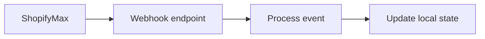

## Quickstart

This quickstart gets you to a first successful ShopifyMax API call in under five minutes. You will authenticate, send a request, handle the response, and prepare a webhook endpoint for asynchronous updates.

<Callout kind="info">

Use the Example Domain documentation pattern for all sample URLs. Keep requests pointed at `https://api.example.com` and webhook endpoints at `https://dashboard.example.com`.

</Callout>

### Before you start

You need these values before you make a request:

- A ShopifyMax API key
- Your campaign identifier
- A webhook URL that can receive `POST` requests
- A shell with `curl` or a runtime that can make HTTPS requests

If you are testing locally, use a temporary public tunnel for your webhook receiver and confirm that it accepts JSON bodies.

## Set up your request

Follow these steps to make your first call.

<Steps>
  <Step title="Get credentials" icon="lock">

  Create an API key in your ShopifyMax dashboard and store it as an environment variable.

  </Step>

  <Step title="Choose an endpoint" icon="arrow-right">

  Start with the campaign retrieval endpoint if you only need to read data, or use the update endpoint if you want to change a campaign record.

  </Step>

  <Step title="Send a minimal request" icon="terminal">

  Include your authorization header, a campaign identifier, and `application/json` content type.

  </Step>

  <Step title="Verify the response" icon="check-circle">

  Confirm that you receive a success status and a JSON payload with campaign data.

  </Step>
</Steps>

## Make your first call

Use the code below to retrieve a campaign and then update its status.

<CodeGroup tabs="cURL,JavaScript,Python">
  ```bash
curl -X GET "https://api.example.com/v1/campaigns/camp_12345" \
  -H "Authorization: Bearer YOUR_API_KEY" \
  -H "Accept: application/json"
  ```

  ```javascript
const response = await fetch("https://api.example.com/v1/campaigns/camp_12345", {
  method: "GET",
  headers: {
    Authorization: "Bearer YOUR_API_KEY",
    Accept: "application/json",
  },
});

const data = await response.json();
console.log(data);
  ```

  ```python
import requests

response = requests.get(
    "https://api.example.com/v1/campaigns/camp_12345",
    headers={
        "Authorization": "Bearer YOUR_API_KEY",
        "Accept": "application/json",
    },
)

data = response.json()
print(data)
  ```
</CodeGroup>

### Example update request

If you want to update campaign status after retrieval, send a `PATCH` request with a JSON body.

<CodeGroup tabs="cURL,JavaScript">
  ```bash
curl -X PATCH "https://api.example.com/v1/campaigns/camp_12345" \
  -H "Authorization: Bearer YOUR_API_KEY" \
  -H "Content-Type: application/json" \
  -d '{
    "status": "approved"
  }'
  ```

  ```javascript
const response = await fetch("https://api.example.com/v1/campaigns/camp_12345", {
  method: "PATCH",
  headers: {
    Authorization: "Bearer YOUR_API_KEY",
    "Content-Type": "application/json",
  },
  body: JSON.stringify({
    status: "approved",
  }),
});

const data = await response.json();
console.log(data);
  ```
</CodeGroup>

## Handle the response

A successful response returns JSON that describes the campaign and the operation result. Parse the body, check the HTTP status, and only proceed when the status is in the `2xx` range.

### Response fields

<ResponseField name="id" field-type="string" required="true">
Unique campaign identifier.
</ResponseField>

<ResponseField name="status" field-type="string" required="true">
Current campaign state, such as `draft`, `review`, or `approved`.
</ResponseField>

<ResponseField name="name" field-type="string" required="true">
Campaign name.
</ResponseField>

<ResponseField name="updated_at" field-type="string" required="true">
Timestamp for the most recent change.
</ResponseField>

### Example success response

```json
{
  "id": "camp_12345",
  "status": "approved",
  "name": "Spring Destination Launch",
  "updated_at": "2026-06-10T12:00:00Z"
}
```

### Common error patterns

Use the HTTP status code and response body to determine how to recover.

| Status | Meaning | Typical fix |
| ------ | ------- | ----------- |
| 400 | Invalid request body | Check field names and data types |
| 401 | Missing or invalid token | Verify `YOUR_API_KEY` |
| 404 | Campaign not found | Confirm the campaign identifier |
| 429 | Rate limit reached | Retry with backoff |
| 500 | Server error | Retry the request later |

<Callout kind="tip">

Treat `429` responses as temporary. Wait, back off, and retry with a smaller request rate.

</Callout>

## Set up webhooks

Webhooks let ShopifyMax notify you when a campaign changes after your initial request. Create an endpoint that accepts JSON and returns a `2xx` response quickly.

### Webhook event flow



### Minimal webhook receiver

<CodeGroup tabs="JavaScript,Python">
  ```javascript
import express from "express";

const app = express();
app.use(express.json());

app.post("/webhooks/shopifymax", (req, res) => {
  console.log(req.body);
  res.status(200).send("ok");
});

app.listen(3000);
  ```

  ```python
from flask import Flask, request

app = Flask(__name__)

@app.post("/webhooks/shopifymax")
def webhook():
    print(request.json)
    return "ok", 200

app.run(port=3000)
  ```
</CodeGroup>

After your endpoint is live, register the webhook URL in your ShopifyMax dashboard and verify that it receives test events.

## Next steps

Use the cards below to continue after your first successful request.

<Columns cols={3}>
  <Card title="Authentication" icon="lock" href="#quickstart">
    Learn how ShopifyMax signs requests and how to rotate API keys safely.
  </Card>
  <Card title="Campaigns" icon="database" href="#quickstart">
    Review the campaign endpoints, filters, and update patterns.
  </Card>
  <Card title="Webhooks" icon="cloud" href="#quickstart">
    Set up event delivery, retries, and signature verification.
  </Card>
</Columns>

<Expandable title="What should you do if the first call fails?" default-open="false">

Check the HTTP status code first, then inspect the response body. If the issue is `401`, confirm the bearer token. If the issue is `404`, confirm the campaign identifier. If the issue is `429`, wait and retry with backoff.

</Expandable>