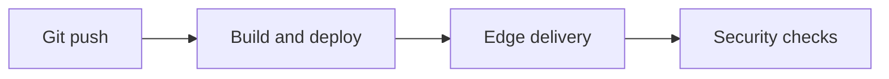

## Changelog

Release notes for Vercel. Newest updates appear first.

<Callout kind="info">

This page is a starter template. Replace the sample entries with your published release history.

</Callout>

<Update label="2026-06-10" description="v1.24.0" tags={["feature"]}>

## AI Cloud

- Added faster model routing in the AI Gateway for supported requests.
- Expanded sandboxed code execution with improved isolation defaults.
- Improved Vercel Agent integration for stack-aware task handling.

## Edge Network

- Rolled out lower-latency routing for dynamic traffic in more regions.
- Improved cache behavior for static assets on the global edge CDN.

## Security

- Tightened bot protection controls for high-traffic routes.
- Improved WAF rule evaluation for common application patterns.

</Update>

<Update label="2026-05-20" description="v1.23.0" tags={["feature", "bugfix"]}>

## Core Platform

- Improved Fluid Compute resource allocation for bursty workloads.
- Reduced deployment wait time after a single Git push.
- Fixed an issue that could delay preview availability on some projects.

## Observability

- Improved trace sampling consistency for long-running requests.
- Fixed missing labels in selected deployment traces.

## Workflow

- Improved status reporting for orchestration runs.
- Fixed a retry edge case for interrupted tasks.

</Update>

<Update label="2026-04-18" description="v1.22.0" tags={["feature"]}>

## Security

- Added broader DDoS protection coverage for public applications.
- Expanded BotID verification handling for login and signup flows.
- Improved Web Application Firewall rule management.

## AI Cloud

- Added more consistent access patterns for the AI Gateway.
- Improved sandbox startup time for repeated execution requests.

## Content Delivery

- Improved edge caching for frequently requested content.
- Added more reliable invalidation handling for updated assets.

</Update>

## What to track

Use each update to capture changes that affect deployment speed, edge delivery, AI features, and security controls.

### Recommended entry format

- Date first.
- Version second.
- Feature and bug fix tags.
- Short bullets with specific outcomes.

### Release areas to include

| Area | What to note |
| --- | --- |
| AI Cloud | AI Gateway, sandboxed execution, Vercel Agent |
| Edge network | CDN behavior, cache changes, routing updates |
| Security | DDoS protection, WAF, BotID |
| Platform | CI/CD, Fluid Compute, observability, workflows |

<Expandable title="Editing checklist" default-open="false">

Before you publish an entry, confirm that you:

- Use the newest update first.
- Keep each bullet factual and concise.
- Avoid marketing language.
- Mention only Vercel features and services.
- Keep the date in ISO format.

</Expandable>

## Example release flow

