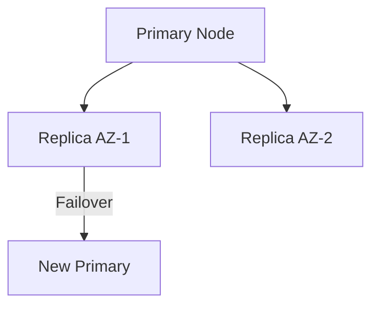

## Overview

PlanetScale delivers the fastest cloud-native MySQL and PostgreSQL databases. You get automatic horizontal sharding, non-blocking schema changes, and resource budgets through Database Traffic Control. These features remove operational overhead so you can focus on building applications.

## Horizontal Sharding and Connection Routing

PlanetScale automatically shards your database across nodes. Connection routing directs queries to the correct shard without changes to your application code.

<Columns cols={2}>
  <Card title="Automatic Sharding" icon="database" href="#">
    Scale writes and storage horizontally with no manual intervention.
  </Card>
  <Card title="Smart Routing" icon="zap" href="#">
    Queries reach the right shard instantly for consistent performance.
  </Card>
</Columns>

## Non-Blocking Schema Migrations

You run schema changes without locking tables or causing downtime. PlanetScale applies migrations online while your application continues to serve traffic.

<Callout kind="tip">
  Test migrations in a branch first to verify behavior before deploying to production.
</Callout>

## Resource Budgets with Database Traffic Control

Database Traffic Control lets you set resource budgets that limit query traffic per workload. You prevent noisy neighbors and maintain predictable performance.

<Tabs>
  <Tab title="Set Budget" icon="settings">
    Define CPU and I/O limits for each application workload.
  </Tab>
  <Tab title="Monitor Usage" icon="bar-chart">
    View real-time consumption and receive alerts when budgets are approached.
  </Tab>
</Tabs>

## High Availability and Failover

PlanetScale replicates data across availability zones. Automatic failover promotes a healthy replica within seconds when a primary node fails.



## Examples

<CodeGroup tabs="Connection,Schema Change">
```bash
pscale connect mydb main --port 3306
```

```sql
ALTER TABLE users ADD COLUMN last_login TIMESTAMP, ALGORITHM=INPLACE;
```
</CodeGroup>

## Best Practices

Follow these guidelines to get the most from PlanetScale.

<Expandable title="Choose the right shard key" default-open="false">
  Select a high-cardinality column that distributes data evenly and matches your common query patterns.
</Expandable>

<Expandable title="Review migration impact" default-open="false">
  Use the migration preview to estimate lock time and affected rows before applying changes.
</Expandable>

- Monitor Database Traffic Control budgets weekly.
- Enable automatic failover alerts for every production database.
- Test connection routing with realistic query loads during evaluation.