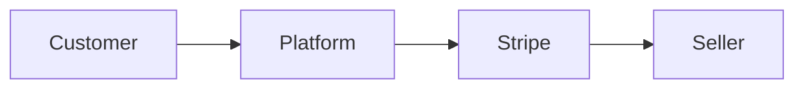

## Overview

Stripe gives you a flexible financial infrastructure layer for accepting payments, managing recurring revenue, routing funds, and reducing fraud risk. You can start with a single use case, then add more capabilities as your business grows. This page introduces the core building blocks so you can evaluate which Stripe products fit your model.

<Callout kind="info">
Use the sample code and examples here as a starting point. You should adapt parameters, currencies, and event handling to your own integration.
</Callout>

## Core product areas

<Columns cols={3}>
  <Card title="Payments" icon="credit-card" href="#">
    Accept one-time payments online, in-app, and in person with global payment methods.
  </Card>
  <Card title="Billing" icon="repeat" href="#">
    Manage subscriptions, invoicing, trials, coupons, and usage-based pricing.
  </Card>
  <Card title="Connect" icon="users" href="#">
    Build marketplaces and platforms that collect payments and route funds to sellers.
  </Card>
  <Card title="Radar" icon="shield" href="#">
    Detect and block suspicious activity with fraud protection signals and rules.
  </Card>
  <Card title="Sigma" icon="bar-chart" href="#">
    Analyze payments data and financial performance with SQL-based reporting.
  </Card>
  <Card title="Pricing" icon="dollar-sign" href="#">
    Review standard pricing and choose the right setup for your volume and region.
  </Card>
</Columns>

## Payments API

The Payments API is the foundation for accepting customer payments. You use it to create payment flows that work across cards and many other payment methods. It supports local preferences, which helps you convert more customers by showing familiar checkout options.

A typical flow creates a payment object on your server, sends the client-side token or secret to the browser or app, and confirms the payment after the customer authorizes it. You can also handle asynchronous methods, such as bank debits or delayed confirmation flows, when you need broader payment coverage.

<CodeGroup tabs="cURL,JavaScript">
  ```bash
  curl https://api.example.com/v1/payment_intents \
    -u YOUR_API_KEY: \
    -d amount=5000 \
    -d currency=usd \
    -d "payment_method_types[]"=card
  ```

  ```javascript
  const response = await fetch("https://api.example.com/v1/payment_intents", {
    method: "POST",
    headers: {
      Authorization: "Bearer YOUR_API_KEY",
      "Content-Type": "application/json"
    },
    body: JSON.stringify({
      amount: 5000,
      currency: "usd",
      payment_method_types: ["card"]
    })
  });
  ```
</CodeGroup>

### When to use Payments

Use Payments when you need:

- One-time checkout
- Saved payment methods
- Multi-currency acceptance
- Online and in-person collection
- A single backend for multiple payment methods

## Billing and subscription management

Billing helps you charge customers repeatedly without rebuilding subscription logic from scratch. You can define plans, set billing intervals, create trials, and support upgrades, downgrades, and proration. It is useful for SaaS, memberships, and any recurring revenue model.

You can also combine subscriptions with invoices or usage-based charges. That lets you support hybrid pricing, such as a base subscription plus metered overages. If you expect customers to change plans often, Billing gives you the controls you need to keep recurring revenue predictable.

### Common billing patterns

- Fixed monthly subscriptions
- Annual plans with discounts
- Metered usage billing
- Free trials that convert to paid plans
- Invoiced contracts for larger accounts

## Connect for marketplaces and platforms

Connect is the product you use when you need to pay third parties, sellers, contractors, or service providers. It helps you onboard connected accounts, route funds, and manage platform fees. This makes it a strong fit for marketplaces, on-demand apps, and software platforms with multiple payees.

The key design choice is how much control you want over the payment flow. Some platforms only need to collect funds and transfer proceeds. Others need deeper control over onboarding, compliance data, and payout timing. Connect supports these models so you can match the flow to your business.



### Connect planning checklist

1. Decide whether you are a marketplace or platform.
2. Define who is the merchant of record.
3. Map onboarding requirements for connected accounts.
4. Plan how platform fees and payouts work.
5. Test refund and dispute handling before launch.

## Radar for fraud detection

Radar helps you reduce fraud by scoring transactions and applying risk-based rules. You can use built-in signals, custom rules, and review workflows to stop suspicious payments without blocking legitimate customers too often. This matters most when you process high volumes or operate in higher-risk regions.

Good fraud protection is usually a mix of automation and human review. Start with Stripe’s default protection, then refine your rules based on chargeback trends, customer segments, and payment methods. As your data grows, you can make your rules more selective and reduce false positives.

<Tabs>
  <Tab title="Safe baseline" icon="shield">
    Use default risk controls first, then review blocked payments and disputes.

  </Tab>
  <Tab title="Rule tuning" icon="settings">
    Add custom rules for velocity, country mismatches, or unusual basket sizes.

  </Tab>
  <Tab title="Manual review" icon="help-circle">
    Create a review process for high-value or ambiguous transactions.

  </Tab>
</Tabs>

## Examples

The examples below show how the core products fit together in common business models. Use them to decide where to begin and what to add later.

<Steps>
  <Step title="Start with checkout" icon="credit-card">
    Launch with Payments so you can accept your first transaction quickly.

  </Step>
  <Step title="Add recurring revenue" icon="repeat">
    Layer on Billing when customers need subscriptions, invoices, or usage-based pricing.

  </Step>
  <Step title="Expand to partners" icon="users">
    Add Connect when you need to pay out sellers, creators, or service providers.

  </Step>
  <Step title="Reduce risk" icon="shield">
    Enable Radar rules and review workflows to keep fraud under control.

  </Step>
</Steps>

## Best practices

To get the most value from Stripe, keep your integration modular. Separate payment creation, fulfillment, subscription logic, and fraud review so you can change one piece without rewriting the rest. That approach makes it easier to support future products, currencies, and payment methods.

A few habits will help you scale cleanly:

- Use idempotent server requests for payment creation.
- Store your own business identifiers alongside Stripe object IDs.
- Test success, decline, and asynchronous payment states.
- Monitor subscription churn and retry outcomes.
- Review fraud patterns regularly instead of only after losses.

<Expandable title="What should you implement first?" default-open="false">
Start with the capability that unlocks revenue fastest. For most teams, that is Payments. If you already sell recurring services, begin with Billing. If you run a platform, Connect may be the first priority.

</Expandable>

<Expandable title="How do you decide between Billing and Connect?" default-open="false">
Use Billing when you charge your own customers over time. Use Connect when you collect money on behalf of other businesses or individuals and need to manage payouts.

</Expandable>

<Expandable title="When should you add Radar?" default-open="false">
Add Radar as soon as you accept real payments at scale. Fraud controls are easier to tune early than after disputes and chargebacks accumulate.

</Expandable>