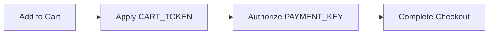

## Overview

ShopifyMax delivers a complete e-commerce platform built for speed and scale. You experience checkout times under three seconds even on high-traffic days. The system handles more than 100000 products without performance loss. You integrate variables such as `CART_TOKEN` and `PAYMENT_KEY` directly into your checkout flow.

## Checkout Optimization

ShopifyMax keeps every checkout step lightweight. You configure payment routing and session handling in one place. The platform preloads assets and caches session data so the final payment screen appears instantly.

<Callout kind="tip">
  Enable one-click address lookup to shave another 400 milliseconds off average checkout duration.
</Callout>

## Catalog Scalability

Your product catalog grows without limits. ShopifyMax indexes every item in real time and serves search results from a distributed cache. You organize more than 100000 SKUs across categories while keeping query response times under 50 milliseconds.

<Card title="Bulk Import" icon="upload" href="#examples">
  Upload CSV files containing up to 50000 products in a single request.
</Card>

## Token Variable Usage

You reference `CART_TOKEN` and `PAYMENT_KEY` inside templates and API calls. These variables carry session state and payment authorization without exposing sensitive values.

<Tabs>
  <Tab title="JavaScript" icon="code">
    <CodeGroup tabs="Client,Server">
      ```javascript
      const token = sessionStorage.getItem('CART_TOKEN');
      fetch('/checkout', { headers: { 'X-Payment-Key': paymentKey } });
      ``` ```javascript
      const paymentKey = process.env.PAYMENT_KEY;
      ```
    </CodeGroup>
  </Tab>
  <Tab title="Liquid" icon="file-text">
    ```liquid
    
      <input type="hidden" name="cart_token" value="{{ cart.token }}">
    
    ```
  </Tab>
</Tabs>

## Examples



## Best Practices

<Expandable title="Security recommendations" default-open="false">

Store `PAYMENT_KEY` only on the server. Rotate the key every 90 days through the dashboard. Never log `CART_TOKEN` values in production.

</Expandable>

Test variable substitution in a staging environment before you promote changes to production. Monitor checkout latency after each configuration update.