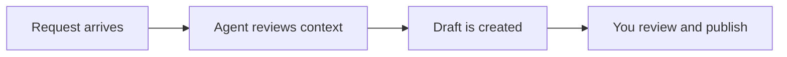

## Overview

Notion is an AI-powered workspace that brings notes, docs, projects, and apps into one place. You use it to centralize knowledge, coordinate work, and reduce the tool sprawl that slows teams down. The platform combines structured content with AI features that help you write, search, summarize, route work, and automate repetitive tasks.

For new users, the fastest way to understand Notion is to think in three layers: content, coordination, and automation. Content lives in docs and wikis. Coordination happens in projects, calendars, and mail. Automation comes from AI agents, meeting notes, and enterprise search. Together, these layers help you keep work moving around the clock.

<Callout kind="info">

Notion works best when you connect your workspace structure to the way your team already collaborates. Start with one shared use case, then expand into adjacent workflows.

</Callout>

<Columns cols={3}>
  <Card title="AI Agents" icon="zap" href="https://www.notion.so/ja/product/agents" target="_blank" cta="Learn more">
    Automate repetitive tasks, route work, and keep processes moving without manual follow-up.
  </Card>
  <Card title="Calendar and Mail" icon="calendar" href="https://www.notion.so/ja/product/calendar" target="_blank" cta="Learn more">
    Coordinate time and communication in the same workspace you use for planning and execution.
  </Card>
  <Card title="Wikis and Projects" icon="book-open" href="https://www.notion.so/ja/product/wikis" target="_blank" cta="Learn more">
    Organize knowledge and project work in a shared, searchable system.
  </Card>
</Columns>

## AI agents and automation

AI agents are the automation layer in Notion. You use them to reduce repetitive work, answer questions, and move tasks forward with less manual intervention. Instead of switching between tools, you keep the context in one workspace and let agents act on it.

Agents are especially useful when the workflow is predictable: triaging requests, preparing summaries, generating status updates, or turning scattered inputs into a repeatable output. Because the agent works inside your workspace context, it can support ongoing work rather than isolated one-off prompts.

<Tabs>
  <Tab title="What agents do" icon="zap">

    Agents help you automate routine work, route requests, and generate outputs that would otherwise require repeated manual effort.

  </Tab>
  <Tab title="Best-fit use cases" icon="check-circle">

    Use agents for status drafts, work routing, knowledge lookup, and recurring updates across teams.

  </Tab>
  <Tab title="What to expect" icon="settings">

    You define the workflow, provide the right context, and review the result before it becomes part of your process.

  </Tab>
</Tabs>

### Example automation workflow



## Meeting notes and writing assistance

Notion AI includes tools that help you capture meetings and turn rough drafts into clear writing. Meeting Notes reduce the burden of manual note-taking by organizing key points, action items, and follow-ups. Writing Assistant helps you refine language, summarize content, and move from a blank page to a usable draft faster.

This is valuable when your team works across many meetings and documents. Instead of copying notes into another tool, you can keep the record close to the work itself. That makes it easier to reference decisions later and to keep project documentation current.

<CodeGroup tabs="Before,After">
  ```markdown
  Project update:
  - Team discussed launch timing
  - Design needs final review
  - Follow-up scheduled for Friday
  ```

  ```markdown
  Project update:
  
  The team reviewed launch timing, identified the final design review as the last open item, and scheduled a follow-up for Friday.
  ```
</CodeGroup>

### Practical guidance

<Expandable title="How to get better output from writing tools" default-open="false">

Start with a clear goal, add the relevant context, and keep the source material focused. Short, specific prompts usually produce more useful drafts than broad requests.

</Expandable>

<Expandable title="How to use meeting notes well" default-open="false">

Capture decisions, action items, and owners during the meeting, then turn the note into a living project reference after the call.

</Expandable>

## Enterprise search

Enterprise Search helps you find answers across your workspace faster. You use it when knowledge is spread across docs, wikis, project pages, and other connected sources. Instead of hunting through folders or asking multiple people, you search once and surface the context you need.

This feature matters most as a workspace grows. The more content your team creates, the more important it becomes to locate the right page, decision, or detail quickly. Search is not just about retrieval; it supports faster decision-making by reducing the time spent looking for information.

<Callout kind="tip">

Treat search quality as a content problem as much as a tooling problem. Clear page titles, consistent structure, and up-to-date documentation make results more useful.

</Callout>

### Common search patterns

- Find prior decisions before starting a new project
- Locate policy details without asking another team
- Recover meeting context before a follow-up
- Reuse existing documentation instead of rewriting it

## Calendar and mail

Notion Calendar and Notion Mail extend the workspace into time and communication. Calendar helps you plan meetings and focus time around the work you manage in Notion. Mail helps you keep communication connected to your broader workflow so you can move from message to task with less friction.

Together, they support a more continuous flow of work. You can review a message, schedule time, update a project, and capture follow-up notes without losing context. That makes them especially useful for teams that need to coordinate across planning, execution, and communication.

<Columns cols={2}>
  <Card title="Notion Calendar" icon="calendar" href="https://www.notion.so/ja/product/calendar" target="_blank" cta="Open Calendar">
    Plan your day around meetings, deep work, and project priorities.
  </Card>
  <Card title="Notion Mail" icon="mail" href="https://www.notion.so/ja/product/mail" target="_blank" cta="Open Mail">
    Keep communication connected to the same workspace where work gets done.
  </Card>
</Columns>

### When to use each tool

| Tool | Best for | Why it helps |
| ---- | -------- | ------------ |
| Calendar | Scheduling and focus time | Keeps time management aligned with active work |
| Mail | Message handling and follow-up | Reduces context switching between communication and execution |
| Workspace pages | Decisions and project context | Stores the record where your team can find it later |

## Wikis and project management

Wikis give your team one shared source of truth. You use them for policies, onboarding, reference material, and any information that should stay easy to find and update. Projects organize execution, making it easier to track ownership, progress, and next steps in the same environment as the documentation.

This combination is powerful because planning and knowledge reinforce each other. A project can link to the wiki pages that explain how work should be done, and the wiki can point back to the project pages that show what is happening now. That reduces duplicate information and keeps teams aligned.

<Steps>
  <Step title="Create a wiki home" icon="book-open">
    Define the pages people need most often, such as onboarding, process guides, and team references.
  </Step>
  <Step title="Connect active projects" icon="rocket">
    Link each project to the docs and decisions it depends on.
  </Step>
  <Step title="Use AI to maintain momentum" icon="zap">
    Summarize updates, draft follow-ups, and surface what needs attention next.
  </Step>
</Steps>

## Best practices

To get value from Notion quickly, start with one team process and build from there. Choose a workflow that has recurring work, clear decisions, and a lot of context loss today. That gives AI features and shared pages something concrete to improve.

Focus on structure before scale. Use consistent page names, keep source content current, and store decisions where the team already works. If you connect agents, search, calendar, and mail to the same system of record, you get a workspace that is easier to maintain and faster to use.

<Expandable title="A simple rollout plan" default-open="false">

Begin with one shared workspace for notes and project tracking, add meeting notes for recurring meetings, then introduce automation where repetitive work is costing time.

</Expandable>

<Expandable title="What to measure" default-open="false">

Track time saved on recurring tasks, search success rate, meeting follow-up completion, and how often teams reuse existing content instead of recreating it.

</Expandable>