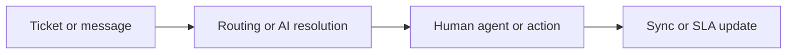

## Troubleshooting Zendesk issues

Use this page when Zendesk is not resolving tickets the way you expect. The sections below focus on common problems with AI agent resolutions, ticket routing and SLA behavior, and integration sync errors.

<Callout kind="info">
If you are blocked, start with the most recent ticket update, the automation or trigger that touched the ticket, and the integration status for the system that is out of sync.
</Callout>

## Quick checks

Before you dig into a specific issue, confirm these basics:

- The ticket has the expected requester, group, assignee, and channel.
- Your trigger, automation, and routing rules are still active.
- The AI agent has access to the right intents, knowledge base content, or actions.
- The external system connected through an integration is still authenticated.
- You can reproduce the problem on one ticket before testing a larger batch.

## Common issues

<Columns cols={3}>
  <Card title="AI agent resolution failures" icon="zap" href="#">
    The AI agent hands off too early, gives the wrong answer, or cannot complete an action.
  </Card>
  <Card title="Ticket routing and SLA problems" icon="arrow-right" href="#">
    Tickets land in the wrong queue, miss SLA targets, or stay unassigned.
  </Card>
  <Card title="Integration sync errors" icon="cloud" href="#">
    Data does not update between Zendesk and a connected system, or updates arrive late.
  </Card>
</Columns>

## AI agent resolution failures

### When you see this

The AI agent replies with a generic fallback, refuses to complete a task, or creates a handoff even when the intent is clear. You may also see replies that say the AI agent cannot access a knowledge article, form field, or action.

<ExpandableGroup>
  <Expandable title="Problem: The AI agent says it cannot help with this request" default-open="true">
    The agent returns a message such as:

    - `I’m sorry, I can’t help with that right now.`
    - `I’m not able to complete this request.`
    - `I could not find a relevant answer.`

    **Cause**

    The intent is too broad, the training content is incomplete, or the agent lacks access to the knowledge article or action needed to finish the resolution.

    **Fix**

    - Narrow the trigger phrase so it matches a specific request.
    - Add or update the help center article the AI agent uses for that topic.
    - Confirm the action is available to the AI agent and the required fields are mapped.
    - Test with one exact customer message and compare the result to a known-good ticket.

  </Expandable>

  <Expandable title="Problem: The AI agent keeps handing off after one message" default-open="false">
    You see the conversation switch to a human agent after the first reply, even when the issue is simple.

    **Cause**

    The confidence threshold is too strict, the article quality is low, or the conversation includes a required step that the AI agent cannot complete.

    **Fix**

    - Review the confidence or fallback behavior for the resolution flow.
    - Rewrite the top article so it answers the question in the first paragraph.
    - Remove conflicting duplicate articles that cover the same topic.
    - If the flow requires a restricted action, move that step to a human handoff by design.

  </Expandable>

  <Expandable title="Problem: The AI agent answers with the wrong policy or outdated article" default-open="false">
    Customers get an answer that no longer matches your current process, pricing, or policy.

    **Cause**

    The AI agent is using stale content, multiple articles say different things, or the source article was updated but not published.

    **Fix**

    - Search for duplicate or conflicting help center content.
    - Republish the corrected article and confirm the live version is the one referenced by the agent.
    - Remove old guidance that still appears in snippets or summaries.
    - Re-test the same request after the content change.

  </Expandable>

  <Expandable title="Problem: The AI agent cannot complete a task that depends on an action" default-open="false">
    The reply looks correct, but the final step never happens. For example, the agent says it will reset a password or update an address, but the action does not run.

    **Cause**

    The action is disabled, the required field is missing, or the integration behind the action is not connected.

    **Fix**

    - Verify the action is enabled in the current flow.
    - Check that every required field has a value before the action runs.
    - Confirm the connected system is authenticated and healthy.
    - Run a single-ticket test and review the event history for the missing step.

  </Expandable>
</ExpandableGroup>

## Ticket routing and SLA problems

### When you see this

Tickets are assigned to the wrong group, bounce between queues, or miss first reply or resolution targets. In some cases, a ticket sits in `New` while the customer is already waiting for a response.

<ExpandableGroup>
  <Expandable title="Problem: Tickets route to the wrong group" default-open="true">
    A ticket lands in a queue that does not match the request, channel, or customer segment.

    **Cause**

    A trigger, view, or routing rule is matching too broadly, or a condition from a previous update is still influencing the ticket.

    **Fix**

    - Review the first matching rule and tighten the conditions.
    - Check for overlapping rules that assign the same ticket in different ways.
    - Confirm the ticket fields used for routing are populated before the rule runs.
    - Re-test with a ticket that uses the exact channel and form that failed.

  </Expandable>

  <Expandable title="Problem: SLA targets do not start or stop when expected" default-open="false">
    The SLA timer appears wrong, or a ticket misses a target even though the work was done on time.

    **Cause**

    The SLA policy is tied to the wrong condition, the ticket status does not match the policy, or a macro changed the ticket in a way that prevented the timer from updating.

    **Fix**

    - Review the SLA policy conditions and confirm they match the intended ticket type.
    - Check whether the ticket status, priority, or form is excluding the SLA.
    - Inspect macros or automations that may pause or resume the timer.
    - Update one ticket and watch the SLA behavior before changing the policy for all tickets.

  </Expandable>

  <Expandable title="Problem: Tickets stay unassigned after form submission" default-open="false">
    A ticket is created, but no agent or group gets assigned.

    **Cause**

    The routing rule depends on a field that is blank, the group is inactive, or the assignment rule is blocked by another rule that runs later.

    **Fix**

    - Verify every routing field is present on the ticket form.
    - Confirm the target group is active and available.
    - Check the rule order so the assignment step is not overwritten.
    - Submit a test ticket with the same form and compare the field values.

  </Expandable>

  <Expandable title="Problem: An SLA breach alert fires too late or not at all" default-open="false">
    You expect an alert before breach, but the alert arrives after the deadline or never appears.

    **Cause**

    The notification condition does not match the SLA policy, the ticket is in a paused state, or the alert recipient is not included in the routing path.

    **Fix**

    - Review the breach notification condition and its timing.
    - Confirm the ticket is not paused or closed before the alert should fire.
    - Check the recipient list and group membership.
    - Test the alert on a ticket that is already close to breach.

  </Expandable>
</ExpandableGroup>

## Integration sync errors

### When you see this

Records update in one system but not in Zendesk, or the reverse happens. You may also see stale customer data, missing ticket comments, or repeated sync attempts.

<ExpandableGroup>
  <Expandable title="Problem: Integration shows a sync error after authentication" default-open="true">
    A connected app stops updating records and shows a message such as `authentication failed`, `401 Unauthorized`, or `token expired`.

    **Cause**

    The connection token expired, the app was reauthorized in the wrong account, or the integration lost permission to read or write the needed records.

    **Fix**

    - Reconnect the integration from the correct admin account.
    - Confirm the app has the required access for tickets, users, or organizations.
    - Retry one known record after the reconnect.
    - Check whether the integration needs a fresh consent grant before sync resumes.

  </Expandable>

  <Expandable title="Problem: Ticket comments do not appear in the other system" default-open="false">
    An internal note or public comment is visible in Zendesk, but the connected system never receives it.

    **Cause**

    The sync rule only watches one comment type, a filter excludes private updates, or the payload exceeds what the integration accepts.

    **Fix**

    - Verify whether the sync covers public comments, internal notes, or both.
    - Review any filters that skip specific ticket events.
    - Check the payload size or field mapping for long comments.
    - Post a short test comment and confirm the transfer before sending a large update.

  </Expandable>

  <Expandable title="Problem: User or organization fields are out of date" default-open="false">
    The customer profile in Zendesk shows the wrong company, phone number, or custom field value after a sync.

    **Cause**

    The external system is sending an older value, the field mapping is one-way, or the latest update is being overwritten by a scheduled import.

    **Fix**

    - Confirm which system is the source of truth for each field.
    - Review whether the field sync is one-way or two-way.
    - Check for scheduled jobs that overwrite recent edits.
    - Update one field manually, then watch which system changes next.

  </Expandable>

  <Expandable title="Problem: Sync loops keep updating the same record" default-open="false">
    The same ticket or user record updates over and over, even when nothing changed.

    **Cause**

    Both systems are reacting to the same event and sending it back and forth, or a workflow changes a field after every sync.

    **Fix**

    - Stop the loop by narrowing the sync trigger.
    - Exclude fields that do not need to sync in both directions.
    - Review automation that rewrites the same value on every update.
    - Test with one record until the update happens only once.

  </Expandable>
</ExpandableGroup>

## Before you contact support

Have these details ready so you can move faster:

- The ticket ID or user record ID.
- The exact error message, such as `401 Unauthorized`, `authentication failed`, or `I could not find a relevant answer.`
- The channel, form, or workflow where the issue happens.
- The last change you made to routing, content, or integration settings.
- A short example of one ticket that fails and one ticket that works.

## Helpful next steps

<Steps>
  <Step title="Reproduce the issue" icon="play-circle">
    Open one affected ticket and repeat the same action. Note the exact message, status change, or failed sync step.
  </Step>
  <Step title="Check the rule path" icon="arrow-right">
    Review the trigger, automation, routing rule, or AI resolution path that handled the ticket first.
  </Step>
  <Step title="Verify the source data" icon="database">
    Confirm the requester, form, fields, and integration data are populated the way your rule expects.
  </Step>
  <Step title="Fix one variable at a time" icon="settings">
    Change one condition, one article, or one mapping, then test again before you move on.
  </Step>
</Steps>

## Reference diagram

## Need more detail?

<ExpandableGroup>
  <Expandable title="How do I know whether the problem is content or routing?" default-open="false">
    If the AI agent gives the wrong answer, start with content. If the ticket lands in the wrong queue or misses timing rules, start with routing or SLA logic.

  </Expandable>

  <Expandable title="What should I test first after a fix?" default-open="false">
    Test one real example that failed before. If that ticket works, repeat the same path with a second ticket that has similar fields and channel details.

  </Expandable>
</ExpandableGroup>