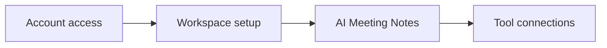

## Overview

Use Notion as your day-to-day workspace for notes, docs, tasks, and AI-assisted work. For a new hire, the main goal is simple: get access, learn where work lives, and use the built-in AI features to reduce setup time.

This guide covers your first week in four areas:

- account setup and AI access
- building your first workspace
- using AI Meeting Notes
- connecting external tools

<Callout kind="info">
Notion is used as the source of truth for team knowledge and project work. If you are not sure where something belongs, put it in Notion first and ask your manager or workspace owner to review the structure.
</Callout>

## First-week checklist

Use this checklist as your starting point. Complete the items in order so you can find information, capture meeting notes, and connect the tools you already use.

<Steps>
  <Step title="Get access" icon="check-circle">

  Confirm that your Notion account is active, you can sign in, and you can open the workspace your team uses.

  Check that you have access to the pages, databases, and teamspaces you need for your role.

  </Step>
  <Step title="Set up your workspace" icon="settings">

  Create or open the pages you need for onboarding, tasks, and notes.

  Save the pages you will use every day as favorites so they are easier to reach.

  </Step>
  <Step title="Turn on AI features" icon="zap">

  Verify that you can use Notion AI, AI Meeting Notes, and Enterprise Search where your workspace allows it.

  Test a simple question or summary so you know the feature is available to you.

  </Step>
  <Step title="Join a meeting and capture notes" icon="book-open">

  Use AI Meeting Notes in your next meeting and review the summary after the call.

  Check that action items, decisions, and follow-ups are captured in a format your team can reuse.

  </Step>
  <Step title="Connect the tools you use" icon="link">

  Connect approved external tools so work can stay in one place instead of across separate apps.

  Ask your team owner before connecting anything that contains customer data or internal records.

  </Step>
</Steps>

## Build your first workspace

Start with a small structure that matches how your team works. You do not need to model everything on day one. Focus on the pages and databases you will touch daily.

A practical starter setup usually includes:

- a personal onboarding page
- a team home page
- a meeting notes page
- a tasks or projects database
- a page for links, policies, and reference material

<Columns cols={3}>
  <Card title="Docs" icon="file-text" href="https://www.notion.so/product/docs">
    Use docs for meeting notes, runbooks, onboarding instructions, and lightweight planning.
  </Card>
  <Card title="Projects" icon="layout-list" href="https://www.notion.so/product/projects">
    Track work, owners, due dates, and status in one place.
  </Card>
  <Card title="Knowledge Base" icon="database" href="https://www.notion.so/product/wikis">
    Store team knowledge so new hires can find answers without asking for the same information twice.
  </Card>
</Columns>

### Recommended setup sequence

1. Create your personal onboarding page.
2. Add links to your team home page and the documents you need.
3. Build or open the projects database your team already uses.
4. Save your most-used pages as favorites.
5. Ask a teammate to review the structure before you add more content.

<Callout kind="tip">
Keep the first version small. A simple structure is easier to maintain than a large page tree that nobody updates.
</Callout>

## Use AI Meeting Notes

AI Meeting Notes helps you turn a live meeting into a written summary. Use it for standups, project reviews, planning sessions, and onboarding calls where decisions and follow-ups matter.

The main workflow is:

- start the meeting note before the call
- let Notion capture the discussion
- review the summary after the meeting
- add or edit action items before sharing

<Tabs>
  <Tab title="Before the meeting" icon="play-circle">

  Create the meeting note in advance and add the agenda, attendees, and goal.

  Include the project or team page link so the summary stays connected to the right work.

  </Tab>
  <Tab title="During the meeting" icon="users">

  Keep the note open while the meeting runs.

  Use the note as the place where decisions, questions, and follow-up items will land.

  </Tab>
  <Tab title="After the meeting" icon="check-circle">

  Review the AI-generated summary for accuracy.

  Confirm the action items and assign owners before you send the note to others.

  </Tab>
</Tabs>

## Connect external tools

Notion can connect to external tools so information does not stay isolated in separate systems. Use connections to bring in the data you need, but only connect services your team approves.

Good candidates for connections include calendars, email, CRM records, and project tools. Your workspace owner may limit what can be connected based on permissions and security rules.

| What you connect | Why it helps | What to check |
| ----------------- | ------------ | -------------- |
| Calendar | Keeps meetings and deadlines visible | Confirm which calendar is connected |
| Mail | Helps you track communication in context | Make sure the account is the right one |
| CRM | Keeps account and customer context near your notes | Confirm access level and data scope |
| Project tools | Reduces duplicate updates across apps | Check who owns the source data |

<Expandable title="When to ask before connecting something" default-open="false">

Ask first if the connection can access customer data, internal records, or sensitive team information. If you are not sure whether a connection is approved, pause and check with your manager or workspace owner.

</Expandable>

## Who to contact

Use the right contact based on the issue you are trying to solve. That keeps setup moving and avoids waiting on the wrong person.

| Need help with | Contact |
| -------------- | ------- |
| Account access or sign-in | IT or workspace admin |
| Page structure or team workspace setup | Your manager or team owner |
| AI access or feature availability | Workspace admin |
| Meeting note workflow | Your teammate who owns the meeting template |
| Tool connections or permissions | Workspace admin or security contact |

<Callout kind="success">
If you can sign in, open your team pages, and create a meeting note, you have enough access to start working in Notion.
</Callout>