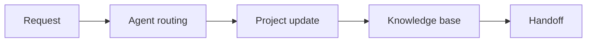

## Purpose

Use this template to document a repeatable workflow in Notion. The workflow should cover how an agent receives work, how the work is tracked in a project, how the knowledge base is updated, and how handoffs happen across teams.

This page is written as an internal process reference. Replace the placeholder names, dates, and ownership details with your team’s actual information. Keep the language concrete so someone can follow the process without asking for extra context.

<Callout kind="info">

This template assumes the workflow runs in Notion using agents, projects, docs, and the knowledge base. Keep all work items linked to the same source of truth.

</Callout>

<Columns cols={3}>
  <Card title="Agent routing" icon="arrow-right" href="#steps">
    Define how incoming requests are classified and assigned.
  </Card>
  <Card title="Project tracking" icon="bar-chart" href="#steps">
    Track status, owners, and due dates in the project view.
  </Card>
  <Card title="Knowledge updates" icon="book-open" href="#steps">
    Record decisions, updates, and reusable notes in the knowledge base.
  </Card>
</Columns>

## Steps

<Steps>
  <Step title="Receive the request" icon="inbox">
    Capture the request in Notion and confirm the request type, urgency, and owner. If the request is incomplete, send it back for clarification before routing it further.
  </Step>
  <Step title="Route with an agent" icon="settings">
    Assign the request to the correct agent based on the work type. The agent should classify the request, add the relevant project link, and suggest the next action. Use the agent for repetitive triage, routing, and status updates.
  </Step>
  <Step title="Create or update the project" icon="check-circle">
    Create the project from the standard template or update the existing project record. Include the summary, owner, due date, dependencies, and current status. Keep the project page as the operational record for the work.
  </Step>
  <Step title="Update the knowledge base" icon="book-open">
    Add the decision, supporting notes, and any reusable procedure to the knowledge base. If the work changes a process, document the change in a way that another teammate can apply later.
  </Step>
  <Step title="Complete the handoff" icon="users">
    Notify the next team with a concise summary, a link to the project, and any open questions. Confirm the handoff in the project so the status stays visible across teams.
  </Step>
</Steps>

### Example structure

Use this sequence for a typical request:

### Working notes

Use the following fields in each project page:

| Field | Purpose | Example value |
| --- | --- | --- |
| Request type | Identifies the workflow path | Process update |
| Owner | Primary accountable person | Team member name |
| Status | Current stage of the work | In progress |
| Due date | Target completion date | 2026-01-15 |
| Source link | Traceback to the intake item | Notion page link |

## Owners

The process owner is `{TBD}`. This person maintains the template, approves changes, and confirms that the workflow still matches how the team actually works.

Use the following placeholder ownership model until the real owners are assigned:

- **Intake owner:** `{TBD}`
- **Agent owner:** `{TBD}`
- **Project owner:** `{TBD}`
- **Knowledge base owner:** `{TBD}`
- **Handoff owner:** `{TBD}`

<Expandable title="Ownership rules" default-open="false">

- One person owns each step, even if multiple teams contribute.
- The process owner resolves ownership gaps.
- Temporary backups should be documented in the same project page.
- Ownership changes should be reflected before the next review date.

</Expandable>

## Review Cadence

Review this process on a regular schedule so it stays aligned with current work patterns. Use the review to confirm that routing rules still match real requests, project templates still capture the right fields, and knowledge updates are still being written in the right place.

Suggested cadence:

- **Weekly:** Check open requests, routing errors, and handoff delays.
- **Monthly:** Review project template fields and knowledge base coverage.
- **Quarterly:** Confirm owners, agent behavior, and cross-team dependencies.

<Callout kind="tip">

If the process changes often, shorten the review cycle and update the template immediately after the change lands.

</Callout>

### Review checklist

1. Confirm every request was routed to the correct agent.
2. Confirm every active project has an owner and a due date.
3. Confirm the knowledge base has the latest decision notes.
4. Confirm the receiving team acknowledged the handoff.
5. Confirm placeholder values have been replaced with current information.

### Revision history

| Date | Change | Owner |
| --- | --- | --- |
| 2026-01-01 | Initial template created | `{TBD}` |
| 2026-02-01 | First review and ownership check | `{TBD}` |