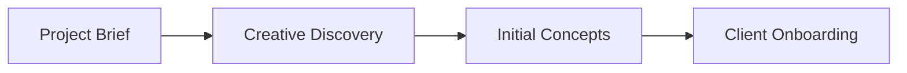

## Quickstart

ShopifyMax helps you move from a rough idea to a clear brand direction fast. In this quickstart, you create a project brief, run creative discovery, shape initial concepts, and prepare client onboarding so you can reach a first review in minutes.

Use the example values here as a starter template. Replace them with your own project details as soon as you are ready.

<Callout kind="info">

This page uses the `example.com` domain for documentation samples only. Do not use it in production operations.

</Callout>

### Before you begin

You should have these items ready before you start:

- A project name
- A short brand summary
- A list of goals, audiences, and key deliverables
- One primary contact for client onboarding

### Four-step setup

<Steps>
  <Step title="Create the project brief" icon="book-open">
    
    Define the brand, audience, scope, and success criteria. Keep this short and specific so your team can move quickly.

  </Step>

  <Step title="Run creative discovery" icon="search">
    
    Gather references, inspiration, and business context. Capture tone, visual direction, and any brand constraints.

  </Step>

  <Step title="Develop initial concepts" icon="palette">
    
    Turn your discovery notes into one or more concept directions. Focus on message, mood, and a clear point of view.

  </Step>

  <Step title="Complete client onboarding" icon="users">
    
    Share the brief, align on review timing, and confirm approvals. This gives everyone a simple path from concept to feedback.

  </Step>
</Steps>

### Minimal working example

Use this template to structure your first project in ShopifyMax.

<CodeGroup tabs="JSON,Markdown">
  ```json
  {
    "projectName": "Coastal Resort Brand Refresh",
    "brief": {
      "goal": "Create a premium identity for a hospitality launch",
      "audience": "Travelers seeking luxury and cultural depth",
      "tone": "Refined, warm, memorable",
      "deliverables": ["Brand direction", "Concept boards", "Client review"]
    }
  }
  ```

  ```markdown
  ## Project Brief

  Goal: Create a premium identity for a hospitality launch.

  Audience: Travelers seeking luxury and cultural depth.

  Tone: Refined, warm, memorable.

  Deliverables: Brand direction, concept boards, client review.
  ```
</CodeGroup>

### What to do next

<Columns cols={3}>
  <Card title="Project briefing" icon="book-open" href="#project-briefing">
    
    Learn how to write a stronger brief that keeps your team aligned from day one.

  </Card>

  <Card title="Creative discovery" icon="zap" href="#creative-discovery">
    
    Explore the prompts and inputs that help you uncover the right brand direction.

  </Card>

  <Card title="Client onboarding" icon="users" href="#client-onboarding">
    
    Set expectations, review timing, and approval flow before you present concepts.

  </Card>
</Columns>

### Example flow



### Need more detail

<Expandable title="What should I include in a brief?" default-open="false">

Include the brand name, business goal, target audience, tone, deliverables, and any must-have constraints. If you already have references, add them here too.

</Expandable>

<Expandable title="How many concepts should I start with?" default-open="false">

Start with two or three clear directions. That gives you enough range to compare options without slowing the review process.

</Expandable>

<Expandable title="When is the project ready for client review?" default-open="false">

You are ready when the brief is complete, the discovery notes are captured, and the initial concepts clearly reflect the agreed direction.

</Expandable>