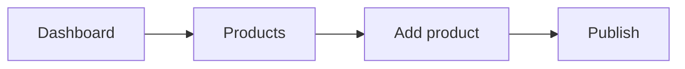

## Prerequisites

<Callout kind="info">
  You need only an email address. No credit card is required to start your trial.
</Callout>

## Create your store

<Steps>
  <Step title="Sign up for ShopifyMax" icon="user-plus">
    Visit the ShopifyMax homepage and enter your email. Confirm the address to receive your store URL.
  </Step>
  <Step title="Choose your plan" icon="credit-card">
    Select the free trial. ShopifyMax activates your store immediately so you can begin setup.
  </Step>
  <Step title="Complete store details" icon="settings">
    Provide your store name and address. ShopifyMax uses this information to configure your checkout automatically.
  </Step>
</Steps>

## Select and apply a theme

<Steps>
  <Step title="Browse built-in themes" icon="layout">
    Open the theme library from your ShopifyMax dashboard. Filter by industry to find a starting design.
  </Step>
  <Step title="Preview and publish" icon="eye">
    Click any theme to preview it with your store data. When satisfied, click Publish to make it live.
  </Step>
</Steps>

## Add your first product



<CodeGroup tabs="JSON,CLI">
```json
{
  "product": {
    "title": "Sample T-Shirt",
    "body_html": "<p>Comfortable cotton tee.</p>",
    "variants": [{ "price": "29.00", "inventory_quantity": 100 }]
  }
}
```
```bash
shopifymax product create --title "Sample T-Shirt" --price 29.00
```
</CodeGroup>

## Next steps

<Columns cols={3}>
  <Card title="Customize checkout" icon="shopping-cart" href="#">
    Learn how to add upsells and payment options.
  </Card>
  <Card title="Connect a domain" icon="globe" href="#">
    Point your own domain to your new store.
  </Card>
  <Card title="Launch marketing" icon="megaphone" href="#">
    Set up email campaigns and social channels.
  </Card>
</Columns>