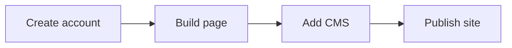

## Quickstart

Use this guide to create your first Webflow site, style a simple page in the visual designer, add structured content with the CMS, and publish to a Webflow-hosted domain.

<Callout kind="info">

Before you begin, create or sign in to your Webflow account, and make sure you have a clear site goal, such as a landing page, portfolio, or campaign page.

</Callout>

## What you complete

In a few minutes, you will:

- Create a new Webflow project
- Build a simple responsive page in the visual designer
- Add a CMS collection for repeatable content
- Configure hosting and publish your site

<Webflow>



</Webflow>

## Before you start

You need a Webflow account and a browser. If you plan to publish to a custom domain later, have access to your DNS provider and your domain registrar.

<Expandable title="What is Webflow?" default-open="false">

Webflow is a Website Experience Platform that lets you design, build, manage, and optimize websites visually. You work in a browser-based designer, connect content with the CMS, and publish on a hosted platform.

</Expandable>

## Set up your account and project

<Steps>
  <Step title="Create your account" icon="users">
    Sign up or sign in to Webflow, then create a new site from the dashboard.

    Choose a blank site if you want the fastest path to first success.
  </Step>

  <Step title="Choose a starting structure" icon="layout-template">
    Start with a simple page structure that includes a hero section, a content section, and a call to action.

    Keep the first version small so you can focus on layout, styling, and publishing.
  </Step>

  <Step title="Open the Designer" icon="paintbrush">
    Launch the visual designer and select the page you want to edit.

    Use the canvas to place elements, adjust spacing, and preview responsive behavior as you build.
  </Step>
</Steps>

## Build your first page visually

The Webflow Designer gives you direct control over layout, typography, spacing, and responsiveness without writing page structure from scratch. You can still work with code-like precision by adjusting classes, components, and breakpoints visually.

<CodeGroup tabs="Designer,HTML concept">
  ```text
Add a section
Add a heading
Add a paragraph
Add a button
Style the layout
  ```
  ```html
<section class="hero">
  <h1>Build with Webflow</h1>
  <p>Create responsive pages visually.</p>
  <a href="#">Get started</a>
</section>
  ```
</CodeGroup>

## Add structured content with the CMS

If your page needs repeated content, use a CMS Collection. A collection stores items such as blog posts, team members, testimonials, or product features so you can update content in one place and reuse it across pages.

<Columns cols={3}>
  <Card title="Design" icon="pen-tool" href="#">
    Create responsive layouts and styles in the visual designer.
  </Card>
  <Card title="CMS" icon="database" href="#">
    Store repeatable content in Collections and connect it to your pages.
  </Card>
  <Card title="Hosting" icon="cloud" href="#">
    Publish securely on Webflow-hosted infrastructure with built-in performance.
  </Card>
</Columns>

### Example CMS workflow

1. Create a collection for your content type.
2. Add a few items with real text and images.
3. Bind collection fields to page elements.
4. Preview the page to confirm the layout updates correctly.

<Callout kind="tip">

Start with one collection and a small number of fields, such as title, summary, image, and slug. You can expand the structure later as your content model grows.

</Callout>

## Configure hosting and publish

Webflow hosting lets you publish your site after you are ready to share it. You can use the default Webflow subdomain first, then connect a custom domain when your site is ready for production traffic.

<Tabs>
  <Tab title="Webflow subdomain" icon="cloud">
    Publish to the default Webflow subdomain to verify layout, content, and responsiveness before going live.
  </Tab>

  <Tab title="Custom domain" icon="globe">
    Connect your domain, update DNS records at your registrar, and publish to your branded URL.
  </Tab>

  <Tab title="Launch checks" icon="check-circle">
    Review links, forms, responsive breakpoints, and CMS content before you publish.
  </Tab>
</Tabs>

## Next steps

After you publish your first page, keep iterating on design, content, and optimization. Webflow also supports personalization, analytics, SEO, and AI-powered experiences for teams that want to improve performance over time.

<Columns cols={2}>
  <Card title="Explore Platform" icon="arrow-right" href="#">
    Learn how Webflow brings design, CMS, hosting, and optimization together.
  </Card>
  <Card title="Improve with AI" icon="sparkles" href="#">
    See how Webflow AI helps you create and refine website experiences faster.
  </Card>
</Columns>

<Expandable title="What should you do next?" default-open="false">

Use the Designer to refine spacing and typography, add more CMS-driven sections, and revisit hosting settings before your public launch. Once the first page is live, you can expand into additional pages and workflows.

</Expandable>