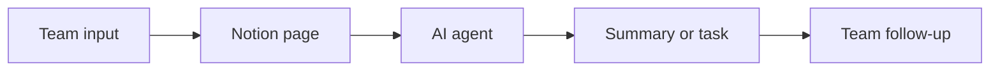

## Overview

Notion gives you one place to plan, write, search, and automate work. In this quickstart, you set up a workspace, turn on AI features, create a simple agent, and connect one external tool so you can reach first success fast.

Use this page as a starter kit. It shows the shortest path to a working setup, then points you to deeper pages for docs, projects, search, and integrations.

<Callout kind="info">
This guide assumes you are evaluating Notion for a team or small organization. You can follow the same steps for personal use, then expand into team settings later.
</Callout>

## What you need first

Before you start, make sure you have an active Notion workspace and permission to manage workspace settings. If you are setting this up for a team, choose one person to own the initial setup so you avoid duplicated configuration.

You also need a clear first use case. A good starting point is one repetitive task, one knowledge source, or one meeting workflow. Notion AI works best when you give it a focused job to do.

<Callout kind="tip">
Start with one workflow, not everything at once. A narrow first success helps you confirm value in minutes.
</Callout>

## Quick setup

Follow these steps in order. The goal is to move from a blank workspace to one automated workflow as quickly as possible.

<Steps>
  <Step title="Set up your workspace" icon="settings">
    
Open your workspace and create a simple structure for the team. Start with a home page, a docs area, a projects area, and a knowledge base. Keep the structure small so people can find things without training.

Choose one owner for workspace administration and one owner for content standards. That keeps page structure, permissions, and naming consistent as the workspace grows.

  </Step>
  <Step title="Enable Notion AI" icon="zap">
    
Turn on Notion AI from your workspace settings, then confirm that AI features are available in pages, search, and meeting notes. This gives you access to writing help, answers from your knowledge base, and task automation.

If your team uses sensitive content, review access controls before you invite broader usage. AI features should reflect the same permissions your workspace already enforces.

  </Step>
  <Step title="Create a first agent" icon="bot">
    
Create an agent for one repeatable task, such as routing requests, summarizing updates, or preparing a weekly report. Give the agent a clear purpose and simple instructions.

Keep the first version short. You want a small, dependable automation that proves the flow before you expand into more advanced behavior.

  </Step>
  <Step title="Connect one external tool" icon="cloud">
    
Connect one source of truth, such as a calendar, mail system, or project tracker. A single connection is enough to validate that Notion can bring outside work into one place.

After the connection is live, test a simple end-to-end flow. For example, capture a request, surface it in Notion, and let the agent prepare a summary or next action.

  </Step>
</Steps>

## Minimal working example

This example shows the shape of a simple setup: one workspace, one AI-enabled page, one custom agent, and one connected source. Adjust the names to match your team.

<CodeGroup tabs="Notion page,Agent prompt,Connection note">
  
```text
Workspace home

- Docs
- Projects
- Knowledge base
- Team updates

AI page

- Summarize this meeting
- Extract action items
- Route follow-ups to the right owner
```

```text
Agent instructions

1. Read the latest meeting notes.
2. Identify decisions, risks, and owners.
3. Create a concise status update.
4. Flag anything that needs follow-up.
5. Keep the output short and actionable.
```

```text
Connection note

Connect one shared tool first.

Examples:
- Calendar for meetings
- Mail for inbound requests
- Project tracker for work intake

Verify that the agent can read the connected context and return a useful result.
```

</CodeGroup>

## Recommended first workflow

Use this simple flow to get value quickly. It works well for teams that want fewer status meetings and faster handoffs.



The main idea is simple: capture work in Notion, let AI process it, and then share a clear next action. Once that loop works, you can expand into docs, projects, meeting notes, and search.

## Where to go next

These pages help you go deeper after your first setup. Choose the path that matches your next goal.

<Columns cols={3}>
  <Card title="Docs" icon="book-open" href="https://www.notion.so/ja/product/docs" target="_blank" cta="Open docs">
    
Create simple, powerful documentation for your team.

  </Card>
  <Card title="Projects" icon="check-circle" href="https://www.notion.so/ja/product/projects" target="_blank" cta="Open projects">
    
Track work, owners, and status in one place.

  </Card>
  <Card title="Enterprise Search" icon="search" href="https://www.notion.so/ja/product/enterprise-search" target="_blank" cta="Learn more">
    
Find answers across your workspace faster.

  </Card>
</Columns>

<Columns cols={3}>
  <Card title="AI Agents" icon="zap" href="https://www.notion.so/ja/product/agents" target="_blank" cta="Build an agent">
    
Automate repetitive work and keep work moving around the clock.

  </Card>
  <Card title="AI Meeting Notes" icon="mic" href="https://www.notion.so/ja/product/ai-meeting-notes" target="_blank" cta="See notes">
    
Turn meetings into clean summaries and action items.

  </Card>
  <Card title="Connections" icon="link" href="https://www.notion.so/ja/connections" target="_blank" cta="Connect tools">
    
Bring external tools into your workspace.

  </Card>
</Columns>

## Common next steps

Once your first workflow works, add the pieces that make Notion more valuable for your team.

- Expand your workspace structure with pages for teams, meetings, and projects.
- Add more agents for routing, reporting, and answering common questions.
- Connect additional tools so Notion can see more of your work context.
- Standardize templates so new pages and projects start with the same format.

<Expandable title="What should I automate first?" default-open="false">
  
Start with the task that repeats most often and needs the least judgment. Good examples include weekly status summaries, meeting recap drafts, and request routing. Once that works, move to more complex workflows.

</Expandable>

<Expandable title="How do I know my setup is ready?" default-open="false">
  
You are ready when a new user can find the workspace home, open the right page, and complete one AI-powered task without extra help. If that is not true yet, simplify the structure and reduce the number of starting points.

</Expandable>