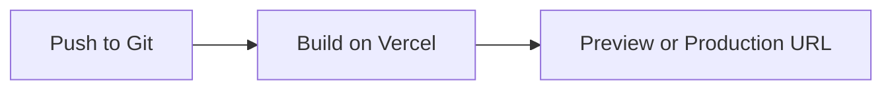

## Quickstart

Vercel helps you go from Git push to a live app with minimal setup. In this quickstart, you connect a repository, verify preview deployments, ship a production build, and point a custom domain at your project.

<Callout kind="info">

Before you start, make sure you have:

- A Vercel account
- A Git repository with an application you want to deploy
- Permission to connect that repository to Vercel
- A domain name if you want to set up a custom domain

</Callout>

## Connect your Git repository

The fastest way to deploy on Vercel is to import a Git repository. Once you connect your repo, Vercel watches for pushes and creates deployments automatically.

<Steps>
  <Step title="Import the repository" icon="github">
    Sign in to Vercel, create a new project, and select the Git repository you want to deploy.

    If Vercel detects your framework, it suggests the right build settings for you.
  </Step>
  <Step title="Review the build settings" icon="settings">
    Confirm the build command, output directory, and environment variables.

    Use the defaults when they match your app, then save the project settings.
  </Step>
  <Step title="Deploy the first build" icon="rocket">
    Trigger your first deployment from the imported repository.

    Vercel runs the build, uploads the output, and gives you a preview URL as soon as the deployment finishes.
  </Step>
</Steps>

## Add a minimal app

You can start with a tiny application that proves the deployment flow works end to end. Use the example below, commit it to your repository, and push it to create your first preview deployment.

<CodeGroup tabs="TypeScript,JavaScript">
  ```typescript
export default function Home() {
  return (
    <main>
      <h1>Hello from Vercel</h1>
      <p>Your app is deployed from a Git repository.</p>
    </main>
  );
}
  ```

  ```javascript
export default function Home() {
  return (
    <main>
      <h1>Hello from Vercel</h1>
      <p>Your app is deployed from a Git repository.</p>
    </main>
  );
}
  ```
</CodeGroup>

After you push the commit, Vercel creates a new preview deployment for that branch. Preview deployments give you a live URL for every change, so your team can review updates before you merge.

## Understand preview and production deployments

Vercel separates preview work from production releases. That separation helps you test safely and ship with confidence.

<Tabs>
  <Tab title="Preview deployment" icon="play-circle">
    Use preview deployments to review changes from branches and pull requests.

    They are ideal for design review, QA, and stakeholder feedback because every push gets its own URL.
  </Tab>
  <Tab title="Production deployment" icon="check-circle">
    Use production deployments for the version of your app that you want users to see.

    When you merge to your production branch, Vercel builds and deploys the latest code automatically.
  </Tab>
</Tabs>

### What happens on each push

Vercel listens for repository changes and runs the right deployment flow for the branch you update.



Preview deployments help you catch issues early. Production deployments give you a stable release path without manual release steps.

## Point a custom domain

After your app is live, connect a custom domain so people can access it through your own brand.

<Steps>
  <Step title="Open domain settings" icon="globe">
    Go to your project settings in Vercel and open the domains section.
  </Step>
  <Step title="Add your domain" icon="plus">
    Enter the domain name you own and follow the verification steps.
  </Step>
  <Step title="Update DNS" icon="external-link">
    Add the DNS records that Vercel provides so your domain routes to the deployment.
  </Step>
  <Step title="Confirm the connection" icon="check-circle">
    Wait for DNS to propagate, then load the domain in your browser to confirm it serves your app.
  </Step>
</Steps>

## Go deeper

Once your first deployment works, explore the parts of Vercel that help you scale from a simple quickstart to a full production workflow.

<Columns cols={3}>
  <Card title="AI Cloud" icon="zap" href="https://vercel.com/ai">
    Explore the AI Cloud capabilities that sit alongside the core platform.
  </Card>
  <Card title="Security" icon="shield" href="https://vercel.com/security">
    Learn how Vercel protects applications with platform security and web application firewall features.
  </Card>
  <Card title="Docs" icon="book-open" href="https://vercel.com/docs">
    Read the Vercel documentation for deeper setup and deployment guidance.
  </Card>
</Columns>

<Expandable title="What should you do after the first deployment?" default-open="false">

After your first successful deployment, add environment variables, connect a custom domain, and verify that preview deployments match production behavior.

If your app grows, you can then explore observability, workflow orchestration, and edge delivery features.

</Expandable>

## Next steps

Your quickstart is complete when you can push code, see a preview deployment, and route a custom domain to production. From here, keep iterating in Git and let Vercel handle the deployment pipeline.