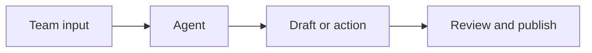

## Welcome

Notion is the team workspace we use for notes, docs, projects, and shared knowledge. It also includes AI features and agents that can automate routine work, summarize information, and help people find answers faster.

Use this page as the entry point for setup guidance, collaboration habits, and links to the main sections of this knowledge base.

<Callout kind="tip">
You can restrict this knowledge base to the team with access control, so only the right people can view or edit the content.
</Callout>

## Quick links

<Columns cols={3}>
  <Card title="AI workspace overview" icon="zap" href="#ai-workspace-overview">
    Learn how Notion brings notes, docs, projects, and AI into one place.
  </Card>
  <Card title="Agent automation basics" icon="settings" href="#agent-automation-basics">
    See what agents can do and where they fit in day-to-day work.
  </Card>
  <Card title="Knowledge base setup" icon="book-open" href="#knowledge-base-setup">
    Set up a team space for policies, references, and shared answers.
  </Card>
  <Card title="Team collaboration" icon="users" href="#team-collaboration">
    Review comments, sharing, and handoff practices for shared work.
  </Card>
</Columns>

## AI workspace overview

Notion gives you one place to keep working notes, docs, project trackers, and team references. That reduces context switching because the information you need is already in the same workspace.

AI features sit on top of that workspace. The main value is that you can ask questions, draft content, and turn scattered information into something usable without moving between tools.

### What belongs here

Use Notion for content that changes often and needs to stay connected:

- Meeting notes that should turn into follow-up tasks
- Docs that need team editing and review
- Project pages with status, owners, and deadlines
- Knowledge articles that should be easy to search and update

### How people typically use it

A common pattern is to keep the source of truth in Notion, then use linked pages and databases to connect related work. For example, a project page can link to meeting notes, a decision log, and a task tracker.

## Agent automation basics

Agents help automate repetitive work. You define the goal, connect the relevant workspace content, and let the agent handle routine actions such as drafting summaries, answering recurring questions, or routing updates to the right place.

Start with narrow tasks. A good first use case is something with clear inputs and repeatable output, like turning meeting notes into action items or generating a weekly status summary.

### Good first automation examples

- Summarize a page after a meeting
- Answer common questions from a knowledge base
- Route requests to the right team or database
- Draft a report from recent project updates

### Simple automation flow

### Implementation notes

Keep the first version small. Give the agent one clear job, check its output, and expand once the team trusts the result. If the workflow touches sensitive content, define who can review or approve the output before it is shared.

## Knowledge base setup

A useful knowledge base starts with a simple structure. Group content by topic, keep page names consistent, and make it easy to find the most current version of each page.

Use top-level pages for major categories like onboarding, policies, project references, and support information. Within each area, prefer short pages that answer one question well.

### Recommended setup

1. Create a home page for the team space.
2. Add a small set of top-level categories.
3. Put recurring reference content in databases or linked pages.
4. Assign an owner to each important page.
5. Review stale content on a regular schedule.

### Minimum page standards

| Item | Recommendation |
| ---- | -------------- |
| Page title | Clear and specific |
| Owner | One accountable person |
| Update cadence | Monthly or quarterly |
| Source of truth | One canonical page |
| Permissions | Limited to the team by default |

<Expandable title="What to avoid when setting up pages" default-open="false">

Avoid creating many overlapping pages for the same topic. That makes search harder and increases the chance that someone edits the wrong copy.

Also avoid storing final decisions only in chat. If something matters later, move it into a page and link it from the relevant project or team area.

</Expandable>

## Team collaboration

Collaboration in Notion works best when people know where to leave updates and how to hand work off. Comments are useful for questions and review, while shared pages and databases help keep the current state visible to everyone.

For teams that work across functions, the main benefit is that you can keep planning, reference material, and execution in the same place. That helps reduce tool sprawl and makes it easier to trace decisions.

### Practical team habits

- Use shared pages for team-facing decisions
- Keep meeting notes linked to the related project page
- Add owners and due dates to active work
- Review comments before marking work complete
- Archive outdated pages instead of leaving them in circulation

### Common collaboration areas

<Columns cols={2}>
  <Card title="Docs" icon="file-text" href="#knowledge-base-setup">
    Store policies, runbooks, and reference material in a single source of truth.
  </Card>
  <Card title="Projects" icon="check-circle" href="#ai-workspace-overview">
    Track work status, dependencies, and handoffs on shared project pages.
  </Card>
  <Card title="Calendar" icon="calendar" href="https://www.notion.so/product/calendar">
    Use calendar context to keep meetings and deadlines visible.
  </Card>
  <Card title="Mail" icon="mail" href="https://www.notion.so/product/mail">
    Keep important communication connected to the workspace.
  </Card>
</Columns>

## Getting started next

If you are new to the workspace, start with the knowledge base structure, then add one or two automation use cases after the content is stable. Once the team has a predictable setup, expand into more agent-driven workflows.

For product details and feature updates, use the Notion product pages and release notes as the source of truth.

<Card title="Notion product overview" icon="external-link" href="https://www.notion.so/product" target="_blank" cta="Open product page">
  Review the main workspace experience and core feature set.
</Card>